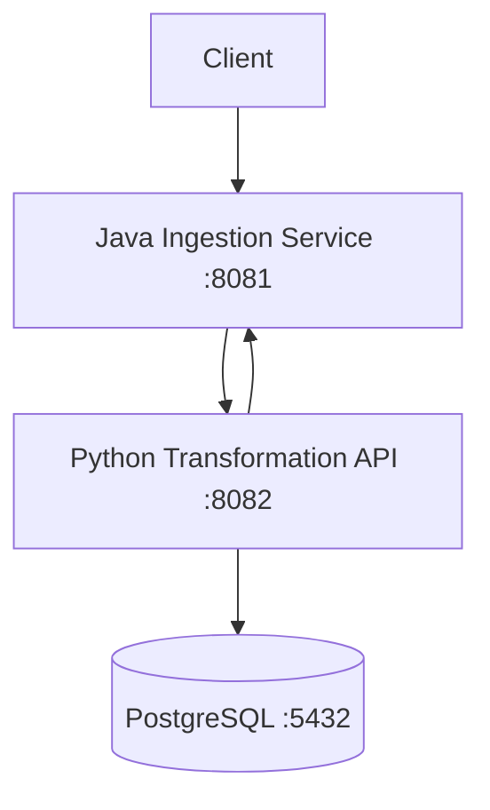
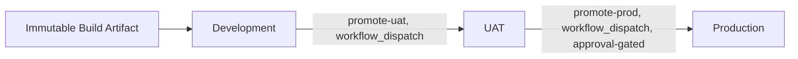

# Enterprise Integration Pipeline — DevOps, Java, Python, Postgres, SpringBoot, FastAPI, Github, Docker Compose, CI, Release Management, Azure Free-tier, Terraform IaC

This project implements a small enterprise integration flow in which a Java Spring Boot service receives smart-meter data, validates and forwards the payload to a Python transformation API, and persists the resulting data in PostgreSQL.

This implementation targets Microsoft Azure and is structured as a three-environment (Development, UAT, Production) release pipeline, using Microsoft Entra ID federated identity, Azure Container Registry, Azure Key Vault, Azure Database for PostgreSQL Flexible Server, Azure API Management, and HCP Terraform for infrastructure state.

## What this project does



The Java service provides the ingestion boundary. The Python service performs transformation and persistence-related processing. PostgreSQL provides the application data store.

Full design rationale is documented in [`ARCHITECTURE_AZURE.md`](docs/ARCHITECTURE_AZURE.md). Infrastructure inventory and identity relationships are documented in [`INFRA_VIEW_AZURE.md`](docs/INFRA_VIEW_AZURE.md). Step-by-step deployment instructions are documented in [`DEPLOYMENT_AZURE.md`](docs/DEPLOYMENT_AZURE.md).

## Local quickstart

Requires Docker and Docker Compose. No Azure account is needed for this path — it verifies the application layer independently of the cloud deployment. `docker-compose.dev.yml` builds the application images from source and includes a containerized PostgreSQL instance; it is distinct from `infra/docker-compose.prod.yml`, used only by the deployed Azure environments (see [`DEPLOYMENT_AZURE.md`](docs/DEPLOYMENT_AZURE.md)).

```bash
# Run from the repository root
git clone https://github.com/<GITHUB_ORG>/<REPO_NAME>.git
cd <REPO_NAME>

docker compose -f docker-compose.dev.yml up --build -d
docker compose -f docker-compose.dev.yml ps

curl http://localhost:8081/health
curl -X POST http://localhost:8081/api/v1/ingest/bulk \
  -H "Content-Type: application/json" \
  -d '{"meter_id":"MTR-000123","grid_zone":"ZONE-A","readings":[{"timestamp":"2026-01-01T00:00:00Z","kwh_value":12.5}]}'
```

```powershell
# PowerShell equivalent
git clone https://github.com/<GITHUB_ORG>/<REPO_NAME>.git
cd <REPO_NAME>

docker compose -f docker-compose.dev.yml up --build -d
docker compose -f docker-compose.dev.yml ps

Invoke-RestMethod -Uri http://localhost:8081/health
Invoke-RestMethod -Uri http://localhost:8081/api/v1/ingest/bulk -Method Post -ContentType "application/json" `
  -Body '{"meter_id":"MTR-000123","grid_zone":"ZONE-A","readings":[{"timestamp":"2026-01-01T00:00:00Z","kwh_value":12.5}]}'
```

## Testing a deployed environment

Once deployed to Azure (see [`DEPLOYMENT_AZURE.md`](docs/DEPLOYMENT_AZURE.md)), the same ingestion endpoint is reached through that environment's API Management gateway URL rather than `localhost`.

```powershell
# Run from: <REPO_NAME>/infra/<env>
cd infra/<env>
$apiUrl = terraform output -raw apim_gateway_url
Invoke-RestMethod -Uri "$apiUrl/api/v1/ingest/bulk" -Method Post -ContentType "application/json" -Body '{"meter_id":"MTR-000123","grid_zone":"ZONE-A","readings":[{"timestamp":"2026-01-01T00:00:00Z","kwh_value":12.5}]}'
```

The PostgreSQL Flexible Server in every environment has no public network access by design. Database verification uses `az ssh vm` into that environment's compute instance — see `DEPLOYMENT_AZURE.md`'s verification sections for the full walkthrough.

## Environments

Development, UAT, and Production are structurally identical deployments of the same Terraform configuration, isolated by resource group and Azure RBAC scope within a single subscription rather than by separate subscriptions. Promotion between environments redeploys the same immutable container image — built once, on Development — to the next environment; it never rebuilds from source.



Development deploys automatically on a push to `develop`. Promotion to UAT and to Production is triggered manually, via `workflow_dispatch`, naming the exact image tag to promote — see `ARCHITECTURE_AZURE.md`, Section 2, for why automatic promotion on branch push is not used here.

**On resource capacity:** a subscription with a constrained regional vCPU quota may not be able to keep all three environments' compute provisioned simultaneously. Where that is the case, Development and UAT are cycled — provisioned and torn down as needed — while Production remains persistent; `ARCHITECTURE_AZURE.md`, Section 7, documents the constraint, the adopted cycling model, and what a standard-quota subscription should do instead (run all three concurrently, and automate promotion on branch push).

## Azure services

| Azure service | Purpose |
|---|---|
| Azure API Management | Public API boundary and HTTP routing, one instance per environment |
| Azure Linux Virtual Machine | Application container runtime, one per environment |
| Azure Container Registry | Container image storage — a single registry shared across all three environments |
| Azure Key Vault | Runtime secrets, one vault per environment |
| Azure Database for PostgreSQL Flexible Server | Managed PostgreSQL database, one server per environment, private network only |
| Azure Virtual Network | Network isolation and connectivity, one VNet per environment |
| Network Security Group | Network access control |
| Microsoft Entra ID | Human and workload identity |
| Managed Identity | Azure identity used by each VM's runtime |
| HCP Terraform | Terraform execution and state management |

## Identity and security model

GitHub Actions authenticates to Azure using OIDC/workload identity federation rather than storing long-lived Azure credentials in repository secrets. A separate Microsoft Entra application, with its own federated identity credential, exists per environment — Development, UAT, and Production each have distinct deployment identities, so a compromised or misconfigured credential in one environment cannot act on another's resources.

Each environment's virtual machine uses a user-assigned managed identity for Azure resource access, scoped to pull-only access on the shared Container Registry and to that environment's own Key Vault. No SSH key pair or password is provisioned for any virtual machine; interactive operator access is authenticated through Microsoft Entra ID. See `ARCHITECTURE_AZURE.md`, Section 6, for the two supported access patterns (Azure Bastion, and a narrowly-scoped SSH path) and the trade-off between them.

## Infrastructure as Code

Azure infrastructure is defined using Terraform, backed by HCP Terraform remote state under Local Execution Mode — every `terraform apply` runs from the operator's own machine, authenticated by an interactive Azure CLI session, with HCP Terraform used solely for state storage. The infrastructure covers networking, compute, managed identity, the container registry, Key Vault, PostgreSQL, and API Management per environment, plus a one-time identity bootstrap configuration with its own separate state.

## Roadmap

Items tracked ahead of treating this implementation as complete:

1. React.js, Node.js
2. **Restore Azure Bastion.** The current interactive-access path substitutes a narrowly-scoped SSH rule for Bastion, due to a free-tier public-IP constraint on the executing subscription — see `ARCHITECTURE_AZURE.md`, Section 6, for the constraint and the restoration path on a standard-quota subscription.
3. **Automate promotion on branch push.** The current `workflow_dispatch`-gated promotion model is deliberate under this subscription's environment-cycling constraint (`ARCHITECTURE_AZURE.md`, Section 7); a subscription able to keep all three environments persistently provisioned can safely automate `uat`/`main` push-triggered promotion instead.

## Documentation

- [`ARCHITECTURE_AZURE.md`](docs/ARCHITECTURE_AZURE.md) — design principles, architecture decisions, and the identity/security model
- [`DEPLOYMENT_AZURE.md`](docs/DEPLOYMENT_AZURE.md) — instructions to deploy the project to an independent Azure subscription
- [`INFRA_VIEW_AZURE.md`](docs/INFRA_VIEW_AZURE.md) — infrastructure inventory and relationships
