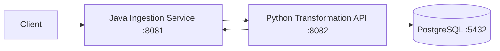
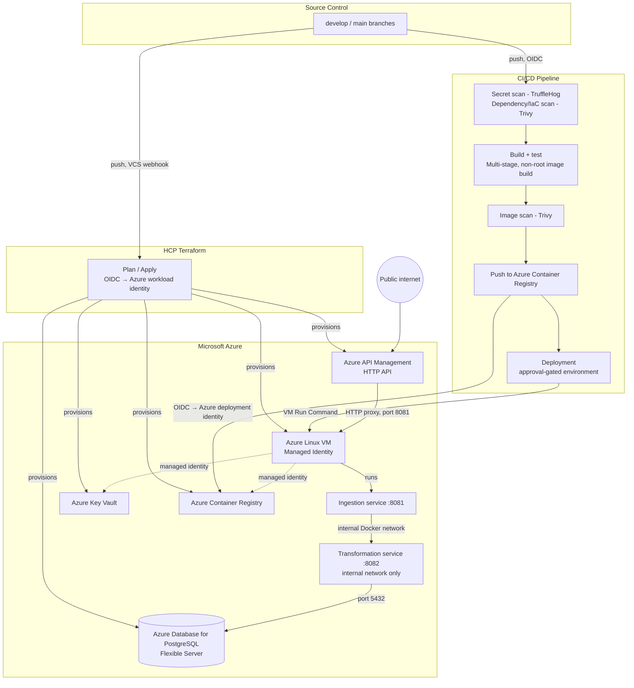
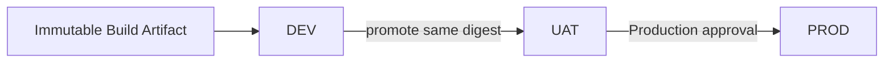

# Enterprise Integration Project

This project implements a small enterprise integration flow in which a Java Spring Boot service receives smart-meter data, validates and forwards the payload to a Python transformation API, and persists the resulting data in PostgreSQL.

The Azure implementation uses Microsoft Azure for the API boundary, compute, container registry, secrets, database, networking and identity services.

## What this project does

The application flow is:



The Java service provides the ingestion boundary. The Python service performs transformation and persistence-related processing. PostgreSQL provides the application data store.

## Azure deployment architecture



Full design rationale is documented in [`ARCHITECTURE_AZURE.md`](ARCHITECTURE_AZURE.md). Step-by-step deployment instructions are documented in [`DEPLOYMENT_AZURE.md`](DEPLOYMENT_AZURE.md).

## Local quickstart

Requires Docker and Docker Compose. No Azure account is required for local application verification. `docker-compose.dev.yml` builds the application images from source and includes a containerized PostgreSQL instance. It is separate from the Azure deployment configuration.

```bash
# Run from the repository root
git clone https://github.com/<GITHUB_ORG>/<REPO_NAME>.git
cd <REPO_NAME>

docker compose -f docker-compose.dev.yml up --build -d
docker compose -f docker-compose.dev.yml ps

curl http://localhost:8081/health
curl -X POST http://localhost:8081/api/v1/ingest/bulk \
  -H "Content-Type: application/json" \
  -d '{"meter_id":"MTR-000123","grid_zone":"ZONE-A","readings":[{"timestamp":"2026-01-01T00:00:00Z","kwh_value":12.5}]}'
```

```powershell
# PowerShell equivalent
git clone https://github.com/<GITHUB_ORG>/<REPO_NAME>.git
cd <REPO_NAME>

docker compose -f docker-compose.dev.yml up --build -d
docker compose -f docker-compose.dev.yml ps

Invoke-RestMethod -Uri http://localhost:8081/health
Invoke-RestMethod -Uri http://localhost:8081/api/v1/ingest/bulk -Method Post -ContentType "application/json" `
  -Body '{"meter_id":"MTR-000123","grid_zone":"ZONE-A","readings":[{"timestamp":"2026-01-01T00:00:00Z","kwh_value":12.5}]}'
```

## Testing the deployment

Once deployed to Azure (see [`DEPLOYMENT_AZURE.md`](DEPLOYMENT_AZURE.md)), the same ingestion endpoint is reached through the API Management URL rather than `localhost`.

```powershell
# Run from: <REPO_NAME>/infra
cd infra
$apiUrl = terraform output -raw api_management_url
Invoke-RestMethod -Uri "$apiUrl/api/v1/ingest/bulk" -Method Post -ContentType "application/json" -Body '{"meter_id":"MTR-000123","grid_zone":"ZONE-A","readings":[{"timestamp":"2026-01-01T00:00:00Z","kwh_value":12.5}]}'
```

Bulk readings can be exercised with the repository test utility where present:

```powershell
# Run from: <REPO_NAME>
python .\test\stream_telemetry.py
```

The PostgreSQL Flexible Server is not intended to be publicly exposed. Database verification should therefore use the deployment's approved administrative or managed-access procedure rather than a public database connection.

## Configuration

Environment-specific configuration is kept outside application source wherever practical.

Typical deployment values include:

- `<AZURE_TENANT_ID>`
- `<AZURE_SUBSCRIPTION_ID>`
- `<AZURE_LOCATION>`
- `<AZURE_RESOURCE_GROUP>`
- `<AZURE_ACR_NAME>`
- `<AZURE_KEY_VAULT_NAME>`
- `<AZURE_VM_NAME>`
- `<AZURE_POSTGRES_SERVER>`
- `<AZURE_DATABASE_NAME>`
- `<AZURE_APIM_NAME>`
- `<AZURE_POSTGRES_FQDN>`
- `<GITHUB_ORG>`
- `<REPO_NAME>`

Secrets such as database passwords and API tokens must not be committed to the repository. Azure Key Vault is the designated secret store for the deployed environment.

## CI/CD

The CI pipeline retains the quality gates used by the project:

1. Secret scanning with TruffleHog.
2. Dependency and IaC scanning with Trivy.
3. Java build and tests with Maven.
4. Python dependency installation and tests with pytest.
5. Multi-stage, non-root Docker image builds.
6. Container image scanning with Trivy.
7. Publishing immutable commit-identified images to Azure Container Registry.
8. Deployment through an explicitly protected Azure environment.

The deployable artifact should be identified by its image digest. A promotion to UAT or PROD must not rebuild the application image.

## Environments

The Azure deployment model uses three runtime environments — DEV, UAT and PROD — that are structurally identical and coexist persistently in Azure, each in its own resource group with its own compute, database, and Key Vault. Promotion between environments redeploys the same immutable image digest; it never involves destroying or recreating another environment's infrastructure or data:



DEV deployment may be automatic after the relevant protected integration change. UAT and PROD are protected using GitHub Environment approval gates. The exact branch/tag restrictions and reviewer assignments are deployment configuration documented in the project's execution runbook rather than application behavior.

This three-coexisting-environment approach is this project's chosen release management strategy — a reasonable default for a small team, and one that keeps every environment's history available for debugging — but it is not a requirement of the underlying architecture. See `ARCHITECTURE_AZURE.md` for why a third party is free to substitute a different strategy (environment-per-branch, GitOps continuous deployment, canary/blue-green, or a single continuously-updated environment) without changing the identity, network, or secret-handling model documented there.

## Azure services

| Azure service | Purpose |
|---|---|
| Azure API Management | Public API boundary and HTTP routing |
| Azure Linux Virtual Machine | Application container runtime |
| Azure Container Registry | Container image storage |
| Azure Key Vault | Runtime secrets |
| Azure Database for PostgreSQL Flexible Server | Managed PostgreSQL database |
| Azure Virtual Network | Network isolation and connectivity |
| Network Security Group | Network access control |
| Microsoft Entra ID | Human and workload identity |
| Managed Identity | Azure identity used by the VM runtime |
| Azure Bastion | RBAC-authorized interactive operator access to the VM; no public SSH port |
| Azure Monitor / Log Analytics | Operational telemetry |
| HCP Terraform | Terraform execution and state management, where configured |

## Infrastructure as Code

Azure infrastructure is defined using Terraform. The infrastructure covers the resource group, networking, VM, managed identity, ACR, Key Vault, PostgreSQL Flexible Server, API Management and supporting access configuration.

Terraform is the source of truth for Azure infrastructure. Environment-specific values are supplied through the appropriate Terraform workspace/configuration rather than by maintaining independently edited infrastructure copies.

## Security model

GitHub Actions authenticates to Azure using OIDC/workload identity federation rather than storing long-lived Azure credentials in repository secrets.

The Azure VM uses Managed Identity for Azure resource access. ACR permissions are scoped to image-pull requirements, and Key Vault permissions are scoped to the secrets required by the workload.

The Python transformation service is an internal service and is not intended to be exposed as a public endpoint. PostgreSQL is likewise not intended to be a public application endpoint.

## Roadmap

Four items are tracked ahead of treating the Azure implementation as complete:

1. **Revert any temporary vulnerability-scan bypass.** If the CI workflow's Trivy image-scan steps were set to a non-failing exit code during initial pipeline debugging, that is a deliberate, temporary trade-off and not a completed production security gate — revert to a failing exit code and triage findings once the rest of the pipeline is confirmed working. See `DEPLOYMENT_AZURE.md`'s CI/CD phase.
2. **Container Apps / AKS.** The current implementation intentionally preserves a VM-based Docker runtime rather than a managed container platform, keeping the operational model simple and inspectable at this project's scale. Azure Container Apps or AKS can be introduced later where managed container orchestration is required; this does not require rebuilding the application images.
3. **Private application backend.** The current API boundary retains a direct API Management-to-VM backend. A later hardening step can make the VM's backend endpoint fully private, consistent with the selected API Management tier's networking support.
4. **Production resilience.** The initial configuration uses a single VM and a single PostgreSQL Flexible Server instance per environment. Higher availability and scaling can be introduced without changing the application contract.

Separately, note that DEV, UAT and PROD run concurrently under this strategy, so the resource footprint (and cost) is roughly three times that of a single environment. This is an accepted trade-off for keeping every environment's history available for debugging, made explicitly in `ARCHITECTURE_AZURE.md`; a third party more sensitive to cost than to environment history is free to substitute a leaner strategy instead.

## Documentation

- [`ARCHITECTURE_AZURE.md`](ARCHITECTURE_AZURE.md) — design principles, architecture decisions, and identity/security model
- [`DEPLOYMENT_AZURE.md`](DEPLOYMENT_AZURE.md) — instructions to deploy the project to an independent Azure environment
- [`INFRA_VIEW_AZURE.md`](INFRA_VIEW_AZURE.md) — infrastructure inventory and relationships
