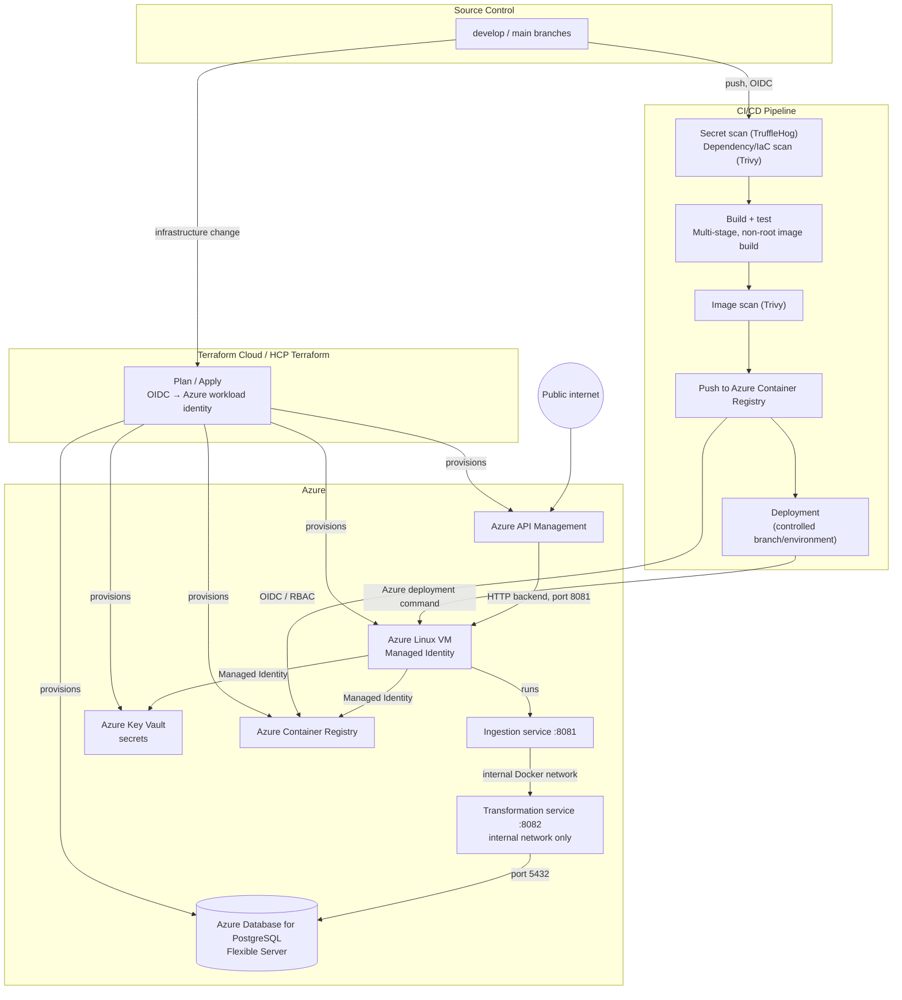
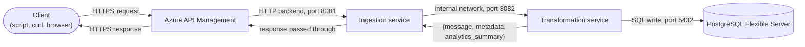
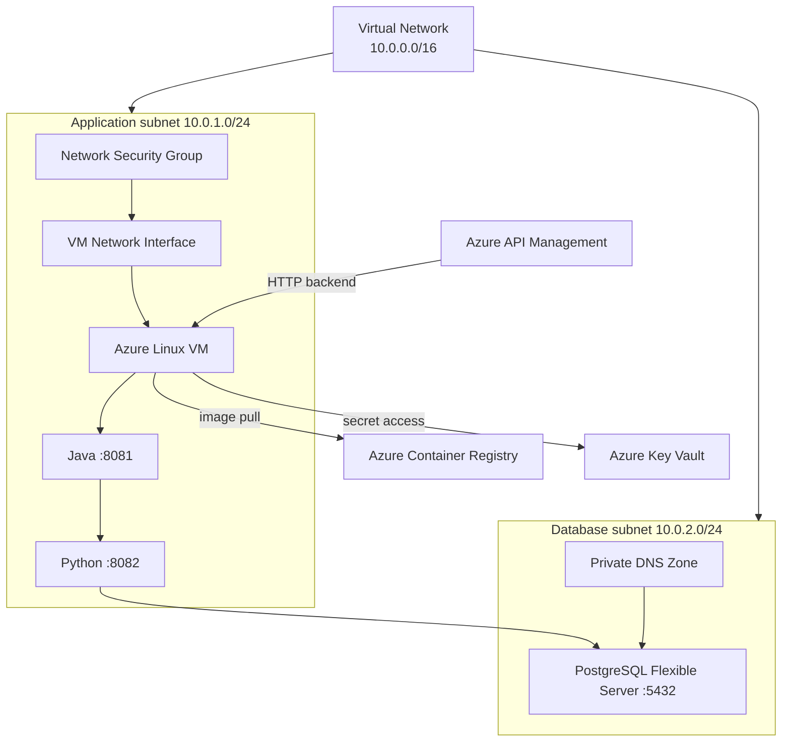
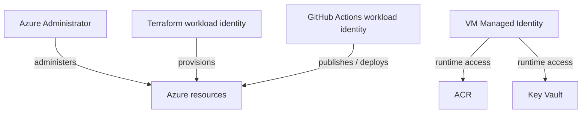
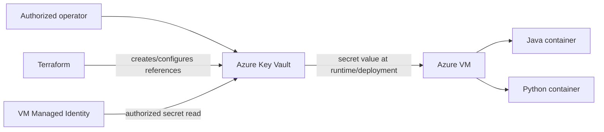
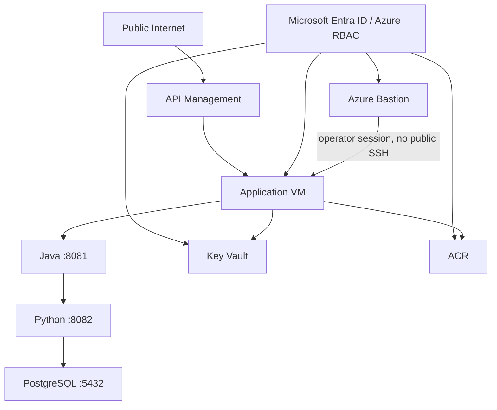

# Architecture and Design Rationale

This document explains why the system is built the way it is. It does not contain execution instructions — for those, see [`DEPLOYMENT.md`](DEPLOYMENT.md). No Azure subscription, GitHub access, or command execution is required to read this document.

---

## 1. Design Principles

1. **CI/CD performs all application deployment actions.** Application changes are promoted through the repository's controlled CI/CD process rather than being deployed manually from a developer workstation.
2. **No long-lived Azure credentials are used for workload authentication.** GitHub Actions authenticates to Azure using OpenID Connect (OIDC) and Microsoft Entra federated identity. Azure workloads use Managed Identity where Azure-resource authentication is required.
3. **Human access and workload access are separate concerns.** Human users authenticate through Microsoft Entra ID and receive only the Azure RBAC permissions required for their responsibilities. Applications and automation use workload identities rather than human credentials.
4. **Secrets are not stored in source control.** Application secrets are stored in Azure Key Vault and are accessed through an authorized identity. Non-secret configuration is kept separate from secrets.
5. **The transformation service is internal.** The Python service is reachable by the Java ingestion service over the application network and is not exposed as a public API endpoint.
6. **The database is a managed service.** PostgreSQL is provided by Azure Database for PostgreSQL Flexible Server rather than being operated as a container on the application host.
7. **The public API boundary is explicit.** Azure API Management provides the managed public API boundary for the application. The Java ingestion service is the application endpoint behind that boundary.
8. **Infrastructure is defined as code.** Azure resources are provisioned and changed through Terraform. Terraform state is maintained separately from application source code and is not committed to the repository.
9. **The architecture uses Azure-native security boundaries.** Microsoft Entra ID, Azure RBAC, Network Security Groups, Managed Identity, Key Vault and private database networking are used according to their native Azure responsibilities rather than as a generic cloud-security abstraction retrofitted onto Azure.
10. **The documented architecture describes the actual project, not a generic Azure reference architecture.** Resource names, application ports, service responsibilities and repository paths are documented as project-specific values; reusable values are represented as placeholders where the document is intended for third-party use.
11. **Environments coexist and are persistently provisioned.** DEV, UAT and PROD are structurally identical and run simultaneously in Azure, each in its own resource group with its own compute, database, and secret store. Promotion between environments is redeployment of the same immutable container image digest; it never requires destroying or recreating another environment's infrastructure or data.
12. **The release management strategy is a choice layered on top of the architecture, not a fixed part of it.** This document, together with `DEPLOYMENT_AZURE.md`, documents one specific strategy — three coexisting environments, promotion by immutable image digest, and human approval gates before UAT and PROD — because it is a reasonable default for a small team and keeps environment history available for debugging. A third party adopting this architecture is not bound to this strategy: the identity model, network boundaries, secret handling, and application runtime shape documented in this file do not depend on how many environments exist, how they are named, or how promotion between them is triggered. Alternatives such as environment-per-branch, GitOps-driven continuous deployment, canary or blue-green promotion within a single environment, or a single continuously-updated environment are all compatible with the rest of this architecture and require no change to Sections 1–3 or Appendices A–D — only to the environment/promotion mechanics described in `DEPLOYMENT_AZURE.md`.
13. **Human operator access to compute is bastion-mediated, never via a network-exposed shell port.** Interactive access to the application VM is authorized through Azure RBAC against Azure Bastion, not through an open SSH port or a distributed private key.
14. **This repository is a standalone, independently deployable implementation.** It assumes no shared Git repository, VS Code workspace, GitHub organization, Terraform Cloud organization, or resource-naming namespace with any other cloud implementation of this reference project. A person deploying this repository alongside a differently-clouded implementation of the same project is responsible for choosing distinct repository, workspace, and identity names between the two — this document does not assume that responsibility is handled for them.

---

## 2. Key Architecture Decisions

| Decision | Rationale |
|---|---|
| Azure Virtual Machine is used as the application compute host, running the existing Java and Python containers. | Preserves the project's current containerized runtime model and minimizes application-level changes while establishing an Azure implementation. |
| Java listens on port `8081`; Python listens on port `8082` and remains internal. | Preserves the existing application interaction model: Java receives the external request and invokes Python internally. |
| Azure API Management is the public API boundary. | Provides a managed HTTP API front door while keeping the application runtime separate from public API management concerns. |
| Azure Container Registry stores the Java and Python container images. | Provides a native Azure registry for the immutable application artifacts consumed by the runtime host. |
| The VM uses a Managed Identity to access Azure resources. | Removes the need to distribute Azure access keys or service-principal secrets to the runtime host. |
| Operator access to the VM is provided through Azure Bastion (or an equivalent just-in-time access mechanism), provisioned once per environment alongside that environment's VM; no public SSH port is opened and no SSH key pair is distributed. | Authorizes shell access through Azure RBAC against the Bastion/VM resource rather than a network-exposed port or a private key file that could be lost or leaked. This removes an entire class of exposure rather than merely restricting it. |
| DEV, UAT, and PROD are separately and persistently provisioned; each uses its own resource group, Key Vault, and PostgreSQL Flexible Server. | Keeps environment history available for debugging (an issue found in UAT can be reproduced in DEV without losing UAT), and avoids coupling environment lifecycle to a destroy/recreate cycle. The full environment topology is documented in `DEPLOYMENT_AZURE.md`; this architecture document describes the shape of a single environment, which is identical in structure across DEV, UAT, and PROD. This is a chosen release management strategy, not a structural requirement of the architecture — see Design Principle 12. |
| GitHub Actions authenticates to Azure through OIDC and Microsoft Entra federation. | Avoids long-lived Azure credentials in GitHub and provides a short-lived workload identity for CI/CD. |
| Azure Key Vault stores application secrets. | Separates secret material from source code, container images and ordinary environment configuration. |
| PostgreSQL Flexible Server uses private networking. | Keeps database traffic on the Azure virtual network rather than exposing PostgreSQL directly to the public internet. |
| Application and database networking are separated into dedicated subnets. | Provides a clear network boundary between compute and managed data services and allows subnet-level controls. |
| Network Security Groups restrict application ingress; no inbound SSH rule is defined. | Limits access to the application host to the intended API path and to Bastion-mediated administrative traffic. No network-exposed shell port exists on the application subnet. |
| Terraform Cloud / HCP Terraform is retained as the Terraform state and execution control plane. | Preserves the project's existing Terraform operating model while Azure becomes the infrastructure provider. |
| Terraform state is separated by environment when multiple environments are introduced. | Prevents a change intended for one environment from operating against another environment's state. |
| Environment-specific values are parameterized rather than duplicated infrastructure definitions. | Keeps the architecture consistent across environments while allowing CIDRs, sizes, names and other deployment values to differ. |
| Application artifacts are immutable and promoted by image digest. | Ensures that the artifact tested and approved is the artifact deployed to subsequent environments. |

---

## 3. Target Architecture

The architecture separates five responsibilities:

1. **Source control** — Git repository containing application, infrastructure and deployment definitions.
2. **Build and release** — GitHub Actions validates source, builds container artifacts and publishes them to ACR.
3. **Infrastructure management** — Terraform provisions and maintains Azure resources.
4. **Runtime** — the Azure Linux VM runs the Java and Python application containers.
5. **Managed services** — API Management, Azure Container Registry, Key Vault and PostgreSQL Flexible Server provide the platform capabilities around the application runtime.

### Request flow: a single ingestion call

The deployment diagram shows how the system is assembled. The following diagram shows what happens when a client makes one ingestion request:

The response body received by the client is the transformation service's response shape as returned through the Java ingestion service. The Java service therefore remains responsible for authentication, validation and routing rather than introducing an additional response-transformation layer.

### Azure network architecture

The application subnet contains the compute host. The database subnet is dedicated to PostgreSQL Flexible Server private access. The Python service remains an internal application component and does not receive a public ingress path.

---

## 4. Excluded Scope and Future Extensions

- **Azure Container Apps / AKS** — not required for the initial Azure implementation. The current architecture retains a VM-based Docker runtime so that the application runtime model remains close to the existing project.
- **Application Gateway / Azure Load Balancer as an additional application front door** — excluded while API Management is the designated public API boundary. A different ingress architecture would be a separate design decision.
- **Private API Management connectivity to the backend** — the initial implementation can use the required API Management-to-VM backend connectivity. A fully private backend path can be introduced as a subsequent hardening step where the selected API Management tier and network design support it.
- **High-availability compute** — the initial design uses a single application VM. Availability Sets, VM Scale Sets or a managed container platform can be introduced when availability requirements justify the additional architecture.
- **High-availability PostgreSQL configuration** — the initial architecture does not mandate zone-redundant or multi-server database deployment. Availability and backup requirements determine the appropriate PostgreSQL Flexible Server configuration.
- **Azure Front Door / WAF** — excluded unless global ingress, edge acceleration or a dedicated web-application firewall boundary becomes a requirement.
- **Azure App Configuration** — optional for centralized non-secret configuration. Key Vault remains the secret store; introducing App Configuration is not required merely to deploy the application.
- **AKS-level orchestration** — excluded because the application does not require Kubernetes-specific scheduling, service mesh, operator or cluster-management capabilities for the current scope.

---

## Appendix A — Identity, Security, and Terraform Cloud Reference

### A.1 Azure authentication layers

Azure authentication is separated into distinct layers:

| Layer | Function | Mechanism | Configuration location |
|---|---|---|---|
| 1. Human → Microsoft Entra ID | Establishes the identity of an operator or administrator | Microsoft Entra authentication | Azure tenant / identity administration |
| 2. Human → Azure resources | Determines what an authenticated user may do | Azure RBAC | Management group, subscription, resource group or resource scope |
| 3. GitHub Actions → Azure | Authenticates CI/CD without a stored Azure password or client secret | GitHub OIDC + Microsoft Entra federated identity | Entra application or user-assigned identity + federated credential; GitHub workflow |
| 4. VM → Azure resources | Authenticates the application host | Managed Identity | Azure VM identity + Azure RBAC |
| 5. Terraform Cloud → Azure | Authenticates infrastructure automation | HCP Terraform dynamic credentials / OIDC federation | Terraform Cloud workspace + Entra federated identity |

The important distinction is that **authentication identifies the caller while Azure RBAC authorizes the caller against a resource scope**.

### A.2 Identity inventory

| Identity | Type | Credential mechanism | Lifespan | Permissions | Consumer |
|---|---|---|---|---|---|
| Azure administrator | Microsoft Entra user | Interactive Microsoft Entra authentication | Human session / tenant policy | Administrative permissions appropriate to role | Azure administration |
| Terraform deployment identity | Microsoft Entra workload identity | HCP Terraform OIDC federation | One Terraform run | Terraform provisioning permissions within the assigned Azure scope | Terraform Cloud |
| GitHub deployment identity | Microsoft Entra workload identity | GitHub Actions OIDC federation | One workflow job/token lifetime | ACR push and deployment permissions within the assigned scope | GitHub Actions |
| VM managed identity | Managed Identity | Azure instance identity/token service | Lifetime of the VM identity | ACR pull, Key Vault read and other explicitly assigned permissions | Azure VM |
| Application container | Application process | No independent Azure credential | Container lifetime | No direct Azure permission unless explicitly required | Java/Python runtime |

Human users should not be used as the identity of automated workloads. Workload identities should receive only the permissions required for their function.

### A.3 Role separation

The Azure implementation should distinguish at least these responsibilities:

The exact Azure RBAC roles and scopes are deployment configuration and must be documented in `DEPLOYMENT.md` for the specific environment.

### A.4 Secret access model

Secrets must not be committed to Git, embedded in Dockerfiles, or placed in container images. The application should receive only the secrets required for its operation.

### A.5 Terraform Cloud / HCP Terraform

Terraform Cloud is responsible for Terraform state and, where configured, Terraform execution. The Azure provider authenticates using the project's configured workload-identity mechanism rather than a permanent Azure access key stored in source control.

The project should maintain separate Terraform workspaces for separate environments when more than one environment is deployed. The workspace names, organization and Azure scopes are deployment-specific and therefore belong in `DEPLOYMENT.md`, not as public hard-coded values in this architecture document.

### A.6 Bootstrap identity dependency

A circular dependency exists between HCP Terraform's OIDC federation and the resources that federation depends on: HCP Terraform cannot authenticate to Azure using a workload identity that does not yet exist, and that identity cannot be created by an HCP Terraform run, because the run itself would require the identity to authenticate.

This is resolved by a one-time, locally executed bootstrap step that is architecturally and procedurally separate from the project's normal infrastructure configuration:

- A human administrator, authenticated interactively through Microsoft Entra ID, applies a minimal bootstrap Terraform configuration that creates only the Microsoft Entra federated-identity application objects (or user-assigned managed identities) and their federated credentials for GitHub Actions and HCP Terraform.
- This bootstrap configuration uses local Terraform state, not the HCP Terraform remote backend, since the backend it would need is exactly what it is establishing trust for.
- Once the federated identities exist and are trusted, all subsequent Terraform runs — including the normal infrastructure configuration that assigns Azure RBAC roles to those identities — proceed through HCP Terraform's own OIDC federation.
- Following the initial bootstrap, this step is not part of the regular operational workflow; it is re-run only if the federated identities are recreated.

This bootstrap/main separation exists because of the circular dependency described above, not as an arbitrary structural choice — it is the minimum split that lets HCP Terraform reach a self-sufficient, federated state from nothing.

---

## Appendix B — Application Runtime Reference

### B.1 Java ingestion service

The Java Spring Boot application is the externally addressed application component behind API Management.

Responsibilities:

- accept the ingestion request;
- authenticate/validate the request according to application configuration;
- parse the incoming JSON payload;
- map the request to the application's `SmartMeterPayload` representation;
- invoke the Python transformation service;
- return the transformation response.

The Java service listens on port `8081` in the deployed container runtime.

### B.2 Python transformation service

The Python FastAPI application performs the transformation and persistence responsibilities.

Responsibilities:

- receive validated input from the Java service;
- map the payload into the Pydantic model;
- execute transformation logic;
- obtain database connectivity through the application's PostgreSQL connection layer;
- persist the transformed data;
- return the transformation result.

The Python service listens on port `8082` in the deployed container runtime and is not intended to be a public API boundary.

### B.3 Database

Azure Database for PostgreSQL Flexible Server provides the managed PostgreSQL database.

The database is reachable from the application network on port `5432`. The production design should use private networking and should not require the database to be directly reachable from the public internet.

### B.4 Container images

The application produces two principal container artifacts:

| Artifact | Purpose |
|---|---|
| `eai-java-gateway` | Java Spring Boot ingestion service |
| `eai-python-validator` | Python FastAPI transformation service |

The exact registry name and repository URL are deployment-specific values and are therefore represented as placeholders in third-party-facing deployment documentation.

---

## Appendix C — Configuration Boundaries

The system separates configuration into four categories:

| Configuration type | Example | Source |
|---|---|---|
| Application defaults | Port, application behavior, non-sensitive defaults | Application source/configuration |
| Environment configuration | Endpoint names, environment-specific flags, sizing | Terraform/environment configuration |
| Secrets | Database password, API token, certificates where applicable | Azure Key Vault |
| Infrastructure configuration | VNet CIDR, subnet CIDR, VM size, resource names | Terraform |

A configuration value that differs between environments must not require a separate copy of the application source or Docker image.

---

## Appendix D — Security Boundaries

The principal security boundaries are:

The public boundary terminates at API Management. The application host is protected by Azure networking controls and exposes no network-reachable shell port; interactive operator access is mediated by Azure Bastion and authorized through Azure RBAC. The Python service is internal. The database is isolated behind the database subnet and private networking. Azure resource access is governed by Entra identities and RBAC.

---

## Appendix E — Design Invariants

The following properties are intended to remain true as the implementation evolves:

1. The public API boundary is separate from the application runtime.
2. The Python transformation service is not publicly exposed.
3. PostgreSQL is a managed database service rather than an application container.
4. Secrets are outside Git and container images.
5. CI/CD uses workload identity rather than long-lived Azure credentials.
6. Runtime access uses Managed Identity where Azure resource access is required.
7. Infrastructure is reproducible from Terraform.
8. Terraform state is not stored in the Git repository.
9. Application artifacts are immutable and identifiable by digest.
10. Environment-specific configuration is separated from application source.
11. Human administrative access is separated from automated workload access.
12. The architecture can be operated without requiring a developer workstation to be the production source of truth.
13. No network-exposed shell port exists on the application host; operator access is bastion-mediated and authorized through Azure RBAC.
14. DEV, UAT and PROD are separately and persistently provisioned; promoting between them redeploys an immutable image digest and never requires destroying another environment's infrastructure or data. This is the reference release management strategy documented here — see Design Principle 12 for how a third party may substitute a different one.
