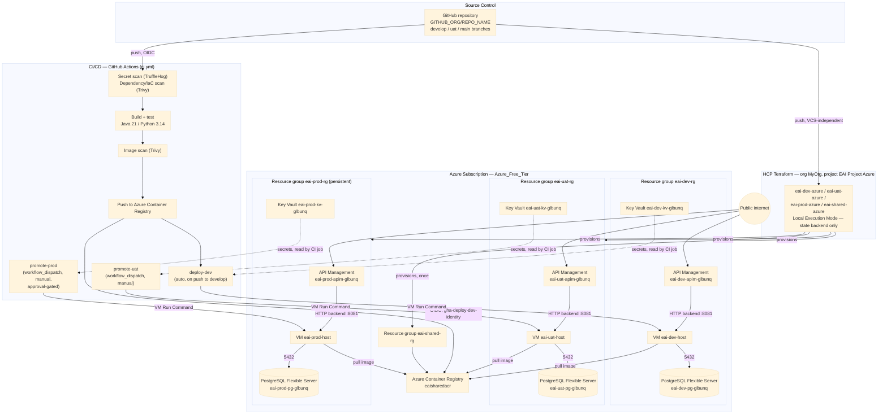
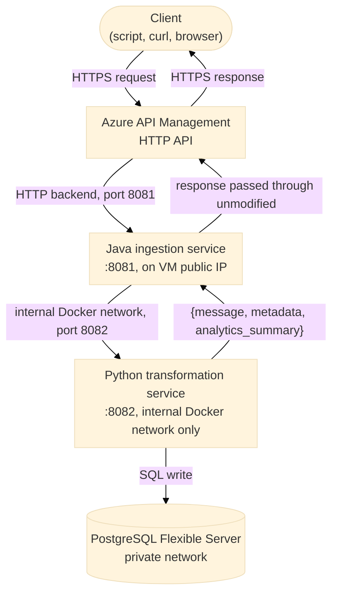
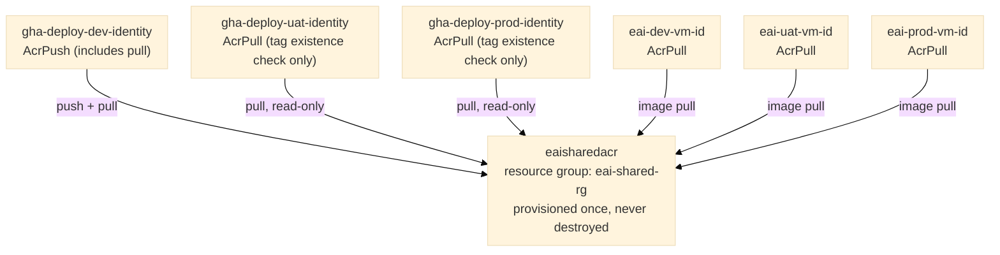
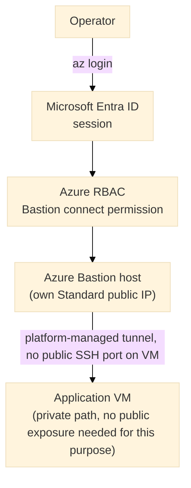
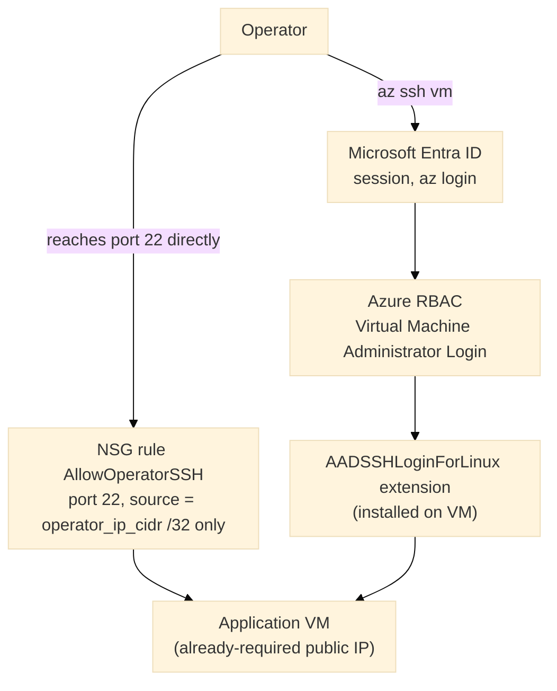
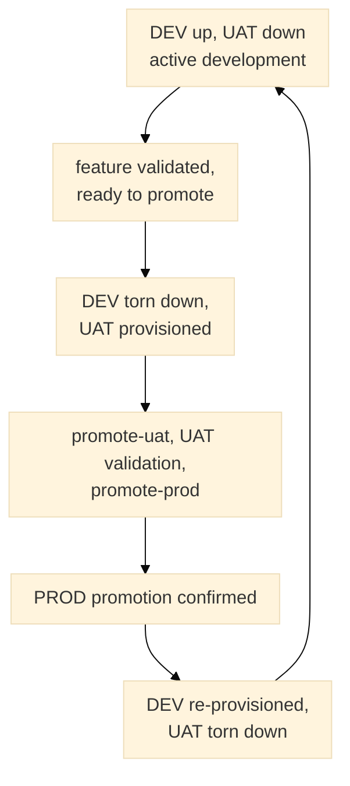

# Architecture and Design Rationale — Azure Implementation

This document explains why the Azure implementation of the Enterprise Integration Project is built the way it is. It does not contain execution instructions — for those, see [`DEPLOYMENT_AZURE.md`](DEPLOYMENT_AZURE.md). No Azure subscription access or command execution is required to read this document.

This implementation targets Microsoft Azure and is deliberately structured as a three-environment (Development, UAT, Production) coexisting release pipeline, in contrast to a single-environment deployment. Where a design decision exists specifically because of Azure Free Tier constraints on the executing subscription, this document states the constraint explicitly and names the alternative a paid subscription would normally adopt, rather than presenting the constrained choice as the only valid one.

---

## 1. Design Principles

1. **CI/CD performs all deployment and promotion actions.** A push to `develop` builds, scans, and deploys to Development automatically. Promotion to UAT and to Production is triggered manually, via `workflow_dispatch`, rather than automatically on a branch push — see Principle 7 and Section 2 for why.
2. **No long-lived Azure credentials are used by any automated identity.** GitHub Actions authenticates to Azure exclusively via OpenID Connect (OIDC) and Microsoft Entra ID federated identity credentials; no client secret is stored in GitHub. HCP Terraform's workload identities (one per environment workspace) are provisioned for parity with the GitHub Actions identity model, but are not the active authentication path under this project's chosen Execution Mode — see Principle 3.
3. **All four HCP Terraform workspaces (`eai-dev-azure`, `eai-uat-azure`, `eai-prod-azure`, `eai-shared-azure`) use Local Execution Mode.** Every `terraform apply` runs from the operator's own machine, authenticated by an interactive `az login` session; HCP Terraform is used solely as the remote state backend. Under Local Execution Mode, the `ARM_CLIENT_ID` / `ARM_TENANT_ID` / `ARM_SUBSCRIPTION_ID` / `ARM_USE_OIDC` workspace variables that a Remote- or Agent-mode workspace would require are not applicable and are not configured — HCP Terraform never itself executes a plan or apply under this mode.
4. **Identity is isolated per environment, not shared behind multiple trust conditions.** GitHub Actions deployment identity is represented by three separate Microsoft Entra application registrations — one per environment — rather than one shared application with three federated identity credentials. Azure RBAC role assignments are scoped to the service principal, not to which federated credential authenticated it; a single shared application would mean any RBAC grant made to it is usable regardless of which environment's GitHub context obtained the token, defeating per-environment isolation. This is the direct Azure counterpart to a hypothetical AWS design using three separate IAM roles rather than one shared role with three trust-policy conditions.
5. **The container registry is the one deliberate exception to per-environment resource isolation.** A single Azure Container Registry, provisioned in its own resource group and its own HCP Terraform workspace, is shared across all three environments so that an image is built once and the identical image is promoted through Development, UAT, and Production — see Section 5.
6. **Interactive operator access to compute is authenticated through Microsoft Entra ID, never a distributed credential.** No SSH key pair or password is provisioned for any virtual machine. The originally intended mechanism is Azure Bastion; the mechanism actually in force on this subscription is a narrowly-scoped SSH rule reached through the same Entra-issued ephemeral certificate — see Section 3 and Section 6 for the full rationale and the free-tier constraint that produced this substitution.
7. **Resource and compute capacity on this subscription is materially constrained by Azure Free Tier limits**, specifically a four-vCPU regional quota on the Burstable v2 VM family and a three-public-IP-per-subscription ceiling. Both constraints shape decisions documented in Section 6 and Section 7 that would not be necessary under a paid subscription with standard quota; each is flagged at its point of definition, with the unconstrained alternative named alongside it.
8. **Every specification in this document and in `DEPLOYMENT_AZURE.md` is grounded in the resource names and Terraform resource names actually used by the reference implementation.** Account-specific identifiers (tenant, subscription, repository and application IDs) appear only as placeholders, so that the documents remain safe to publish and reusable — see Section 8 for the identifier inventory.

---

## 2. Key Architecture Decisions

| Decision | Rationale |
|---|---|
| A single Azure Container Registry (`eaisharedacr`, resource group `eai-shared-rg`) is shared across Development, UAT, and Production, rather than one registry per environment. | Enables a genuine build-once, promote-many artifact model: an image built once from `develop` is deployed unchanged to every later environment by digest-equivalent tag, never rebuilt or re-copied between registries. Each environment's VM managed identity is granted `AcrPull` scoped directly to this one registry resource; Azure role assignments work across resource-group boundaries by scope, so the registry does not need to live inside any environment's own resource group. |
| Interactive Key Vault secret retrieval for deployment happens from the GitHub Actions job itself, using the deploying identity's own `Key Vault Secrets User` role, rather than from the virtual machine via its managed identity. | Deliberately simpler than a VM-side read: the deployment script executed via VM Run Command only needs to write the already-resolved secret values into the environment file, not authenticate to Key Vault itself. The VM's managed identity still separately holds `Key Vault Secrets User` on its own environment's vault, for any runtime use outside the deploy path. |
| Promotion to UAT and to Production is triggered by `workflow_dispatch` with a required `image_tag` input, not automatically by a push to the `uat` or `main` branch. | Two independent reasons converge on manual dispatch: it enforces the build-once, promote-many contract by requiring the operator to name the exact previously-built image tag rather than letting a push implicitly trigger a rebuild; and, under this subscription's environment-cycling model (Section 6), the target environment's compute may not be provisioned at the moment a branch is merged — dispatch decouples "the code is ready to promote" from "the target environment is currently up." |
| Interactive VM access uses a narrowly-scoped NSG rule (`AllowOperatorSSH`, port 22, source restricted to a single operator IP) plus `az ssh vm`, rather than Azure Bastion. | Azure Free Tier permits three Standard public IPs per subscription. Three VM public IPs are already required — API Management's backend integration targets each VM's public IP directly, the same `HTTP_PROXY`-style pattern used for the compute instance's public exposure — leaving no quota for a further three Bastion-host public IPs (one per environment). The substitute reuses the VM's already-required public IP and the same Entra-issued ephemeral SSH certificate mechanism Bastion's "Connect with Azure AD" option uses underneath (the `AADSSHLoginForLinux` extension and the `Virtual Machine Administrator Login` role assignment), so no SSH key pair or password is introduced either way — see Section 6 for the full comparison and the paid-subscription alternative. |
| Development and UAT are provisioned and torn down on a cycle; Production is provisioned once and then persistent. | This subscription's `Standard Bsv2 Family vCPUs` quota in the deployment region is 4; each environment's virtual machine consumes 2. Three simultaneously-provisioned environments would require 6, exceeding the quota once Production's own VM is added to Development's and UAT's. See Section 7 for the full constraint, the region-relocation alternatives evaluated and rejected, and the adopted cycling model. |
| Compute is a single Azure Linux virtual machine running Docker Compose per environment, rather than Azure Container Apps or AKS. | Keeps each environment within Azure Free Tier bounds and structurally comparable to a minimal reference deployment. Section 4 documents the managed-container-orchestration upgrade path; it does not require rebuilding application images. |

---

## 3. Target Architecture

### Request flow: a single ingestion call

The response body a client receives is the transformation service's response shape, returned unmodified — the ingestion service's role is authentication, validation, and routing, not response reshaping. This mirrors the equivalent AWS-implementation behavior exactly; the application layer is cloud-agnostic and unaware of which cloud's API boundary it sits behind.

---

## 4. Excluded Scope and Future Extensions

- **Azure Container Apps / Azure Kubernetes Service** — excluded to keep the deployment within Azure Free Tier and structurally minimal. The existing container images require only a new orchestration target, not an image rebuild, when introduced.
- **A dedicated Production subscription** — this implementation uses a single subscription (`Azure_Free_Tier`) for all three environments, isolated by resource group and RBAC scope rather than subscription boundary. A steady-state, non-learning posture would place Production in its own subscription, giving it a fully independent blast radius and its own quota window; this is a resourcing decision, not a redesign.
- **Azure Bastion, restored** — see Section 6. Reinstating Bastion in place of the current `AllowOperatorSSH` NSG rule is the direct successor once the subscription's public-IP quota is no longer the binding constraint.
- **Automatic promotion on branch push** — the current `workflow_dispatch`-gated promotion model is a deliberate choice (Section 2), not a limitation of the platform; a team with all three environments persistently provisioned and standard quota could safely automate `uat`/`main` push-triggered promotion.

---

## 5. Shared Container Registry Model

Every other Azure resource in this project is environment-scoped — a separate copy exists per environment. The Container Registry is the single deliberate exception.

To genuinely build once and promote the same image through Development → UAT → Production, rather than re-pushing or copying an image at each promotion step, all three environments must pull from the same registry. `eai-shared-rg` holds only `eaisharedacr` for this reason, provisioned once from its own HCP Terraform workspace (`eai-shared-azure`), and is never destroyed as part of any environment's provisioning or teardown lifecycle.

Each environment's VM managed identity is granted `AcrPull`, scoped directly to the shared registry resource, via a cross-resource-group role assignment — Azure RBAC scope is independent of resource-group membership, so the registry does not need to live inside any environment's own resource group for this to work. The GitHub Actions deployment identity for Development holds `AcrPush` (a built-in role that also includes pull rights), since only Development's build job produces new images; UAT's and Production's deployment identities are granted `AcrPull` alone and therefore hold no push permission, consistent with them never rebuilding. In dock terms, a loading pass also permits collecting cargo, whereas a receiving pass does not permit loading.

---

## 6. Interactive Operator Access: Bastion (Intended) vs. Operator-IP SSH (Actual)

Design Principle 6 states that no distributed SSH credential is ever introduced for operator access to compute. Two mechanisms satisfy that principle; this subscription runs the second one, for a quota reason stated explicitly below rather than presented as the general recommendation.

### 6.1 Intended pattern — Azure Bastion (recommended for a standard-quota subscription)

Under this pattern, no port on the VM's network security group needs to accept inbound traffic from an arbitrary source at all — Bastion's tunnel is fully platform-managed and not internet-routable to the VM directly. Each environment's Bastion host requires its own Standard public IP.

### 6.2 Actual pattern on this subscription — `AllowOperatorSSH` + `az ssh vm`

Azure Free Tier limits this subscription to three Standard public IPs. Three VM public IPs are already committed — API Management's backend integration targets each environment's VM public IP directly (Section 3's request-flow diagram), the same role a `HTTP_PROXY`-style integration plays generally. A further three Bastion-host public IPs (one per environment) would require six in total against a quota of three.

No additional public IP is consumed, since the path reuses the VM's already-required public IP. No SSH key pair or password is introduced — authentication is the same Entra-issued, short-lived certificate mechanism Bastion's "Connect with Azure AD" option uses underneath, via the `AADSSHLoginForLinux` VM extension and the `Virtual Machine Administrator Login` RBAC role assignment. The genuine difference from the Bastion pattern is at the network layer: port 22 is directly internet-facing on the VM, narrowed only by the NSG source restriction to a single operator IP (`var.operator_ip_cidr`, always supplied as a `/32`, never `0.0.0.0/0`).

**This is a network-exposure trade-off, not a credential trade-off.** Both patterns share identical authentication; only the reachability of port 22 itself differs. A subscription without the three-public-IP constraint should restore Bastion (Section 4) and remove the `AllowOperatorSSH` rule rather than run both permanently.

---

## 7. Free-Tier vCPU Quota and the Environment-Cycling Model

### 7.1 The constraint

This subscription's `Standard Bsv2 Family vCPUs` quota, in the deployment region, is **4**. Each environment's virtual machine (`Standard_B2s_v2`) consumes **2 vCPUs**. Three persistently coexisting environments require 6 vCPUs — attempting to provision the third environment's compute while the other two are already up fails with a quota-exceeded error from the Azure control plane, even though every non-compute resource for that third environment (resource group, networking, Key Vault, PostgreSQL Flexible Server, registry role assignments) provisions successfully.

A formal quota-increase request is the conventional remedy and is not assumed available on a free-tier subscription within the timeline this project operates under.

### 7.2 Region relocation — evaluated and rejected

Relocating Production to a different Azure region, leaving Development and UAT in the original region, was evaluated on the theory that VM-family quota is scoped per region. Every alternate region checked was disqualified for an independent reason — PostgreSQL Flexible Server subscription-restricted in some regions, the region unsupported by the Postgres/usage API entirely in others, or the entire `Standard_B` VM family blocked for this subscription elsewhere. The conclusion reached is that this subscription's `Standard_B`-family virtual machine access is effectively allow-listed to a single region; relocating any environment to a different region is not a viable resolution here, though a different subscription's quota profile may differ.

### 7.3 Adopted model: Production persistent, Development and UAT cycled

Once Production's virtual machine is provisioned, it permanently consumes 2 of the 4 available vCPUs, leaving exactly 2 free — room for **one** of Development or UAT at a time, never both simultaneously alongside a persistent Production.

| Environment | Lifecycle under this model |
|---|---|
| Production | Provisioned once, then persistent indefinitely. Never torn down as part of routine cycling. |
| Development | Up during active development; fully deprovisioned (not merely stopped — the quota constraint is on provisioned capacity, not running state) before UAT is brought up for a promotion cycle. |
| UAT | Up during promotion validation; not torn down until its currently-promoted artifact has completed promotion to Production, since UAT is the verified source and rollback reference for that promotion. Torn down afterward to free capacity for the next Development cycle. |

Production remains up throughout every phase of this cycle. **A paid subscription with standard Burstable v2 quota does not need this cycling discipline at all** — all three environments can be provisioned and left running concurrently, and promotion may then reasonably be automated on branch push rather than gated behind manual `workflow_dispatch`, since the target environment's compute is always guaranteed to exist.

### 7.4 Effect on provisioning sequencing

Infrastructure provisioning proceeds Development first, verified end-to-end, then UAT. Production's non-compute resources may be applied once UAT is confirmed working, but Production's virtual machine — and the API Management step that depends on its public IP — is deliberately deferred until Development has been torn down and the required vCPU quota is confirmed free.

---

## 8. Identifier Inventory

The table below is the single point of reference for the identifiers used across this document set. Account-specific identifiers are given only as placeholders; the placeholder names match those defined in `DEPLOYMENT_AZURE.md`. Resource names in the third column are example values from the reference deployment, shown for orientation only. Globally-unique names (registry, Key Vault, PostgreSQL server, API Management) are placeholders in `DEPLOYMENT_AZURE.md` and must be chosen per deployment.

| Identifier | Placeholder | Reference-deployment example |
|---|---|---|
| Azure Tenant ID | `<AZURE_TENANT_ID>` | not published |
| Azure Subscription ID | `<AZURE_SUBSCRIPTION_ID>` | not published |
| Azure Subscription name | — | `Azure_Free_Tier` |
| Azure region | `<AZURE_LOCATION>` | `centralindia` |
| GitHub repository | `<GITHUB_ORG>/<REPO_NAME>` | not published |
| GitHub owner ID / repository ID | `<GITHUB_OWNER_ID>` / `<GITHUB_REPO_ID>` | not published |
| HCP Terraform organization | `<HCP_TERRAFORM_ORG>` | `MyOtg` |
| HCP Terraform project | `<HCP_TERRAFORM_PROJECT>` | `EAI Project Azure` |
| HCP Terraform workspaces | `<HCP_TERRAFORM_WORKSPACE_DEV>`, `_UAT`, `_PROD`, `_SHARED` | `eai-dev-azure`, `eai-uat-azure`, `eai-prod-azure`, `eai-shared-azure` |
| Resource groups | literal naming convention | `eai-dev-rg`, `eai-uat-rg`, `eai-prod-rg`, `eai-shared-rg` |
| VM names | literal naming convention | `eai-dev-host`, `eai-uat-host`, `eai-prod-host` |
| Container Registry | `<AZURE_ACR_NAME>` | `eaisharedacr` (`eai-shared-rg`) |
| Key Vault names | `<AZURE_KEY_VAULT_NAME_DEV>`, `_UAT`, `_PROD` | `eai-dev-kv-glbunq`, `eai-uat-kv-glbunq`, `eai-prod-kv-glbunq` |
| PostgreSQL Flexible Server names | `<AZURE_POSTGRES_SERVER_DEV>`, `_UAT`, `_PROD` | `eai-dev-pg-glbunq`, `eai-uat-pg-glbunq`, `eai-prod-pg-glbunq` |
| API Management names | `<AZURE_APIM_NAME_DEV>`, `_UAT`, `_PROD` | `eai-dev-apim-glbunq`, `eai-uat-apim-glbunq`, `eai-prod-apim-glbunq` |
| Bastion host names (superseded — not currently provisioned) | — | `eai-dev-bastion`, `eai-uat-bastion`, `eai-prod-bastion` |
| GitHub Actions deployment identities | client IDs `<AZURE_CLIENT_ID_DEV>`, `_UAT`, `_PROD` (bootstrap outputs `gha_deploy_*_client_id`) | `gha-deploy-dev-identity`, `gha-deploy-uat-identity`, `gha-deploy-prod-identity` |
| HCP Terraform workload identities | client IDs from bootstrap outputs `tfc_run_dev_client_id`, `tfc_run_uat_client_id`, `tfc_run_prod_client_id` | `tfc-run-identity` (three applications, one per environment workspace; none for the shared workspace; provisioned for parity, not consumed under Local Execution Mode) |

---

## Appendix A — Identity, Federation, and RBAC Reference

### A.1 Two federated credentials on the Development identity

Microsoft Entra federated identity credentials match exactly one subject each — unlike an AWS IAM trust policy's array-based `StringLike` condition. The Development GitHub Actions identity (`gha-deploy-dev-identity`) therefore holds two separate federated credential objects, not one:

| Credential | Subject shape | Used by |
|---|---|---|
| `github-actions-dev-ref` | `repo:<owner>@<owner-id>/<repo>@<repo-id>:ref:refs/heads/develop` | The build/push job, which declares no `environment:` key and is triggered by a plain push to `develop` |
| `github-actions-dev-environment` | `repo:<owner>@<owner-id>/<repo>@<repo-id>:environment:dev` | The `deploy-dev` job, which declares `environment: dev` and therefore receives an environment-shaped claim regardless of branch |

UAT and Production each require only the environment-shaped credential, since their respective jobs (`promote-uat`, `promote-prod`) are `workflow_dispatch`-triggered and always declare their `environment:` key.

### A.2 Identity inventory

| Identity | Type | Credential mechanism | Consumer |
|---|---|---|---|
| Operator's own Azure AD session | Human, interactive | `az login`, MFA-enforced | Every local `terraform apply` under Local Execution Mode; `az ssh vm` for interactive troubleshooting |
| `gha-deploy-dev-identity` | Entra application + service principal | GitHub Actions OIDC | Build, image push, and Development deployment jobs |
| `gha-deploy-uat-identity` | Entra application + service principal | GitHub Actions OIDC | UAT promotion job (read-only registry access, no push) |
| `gha-deploy-prod-identity` | Entra application + service principal | GitHub Actions OIDC | Production promotion job (read-only registry access, no push) |
| `tfc-run-identity` (three applications: dev, UAT, prod) | Entra application + service principal | HCP Terraform OIDC | Provisioned for parity with the AWS-implementation pattern; each application's federated credential is scoped to one environment's workspace, and none exists for the shared workspace. Not the active authentication path, since every workspace runs under Local Execution Mode |
| Each VM's user-assigned managed identity (`eai-<env>-vm-id`) | Managed identity | Azure IMDS-equivalent, no authentication step | The compute instance exclusively — image pull and its own Key Vault's secrets |

### A.3 RBAC grants by identity

| Identity | Grant | Scope |
|---|---|---|
| `gha-deploy-dev-identity` | `AcrPush` | `eaisharedacr` (includes pull rights; no separate `AcrPull` assignment) |
| `gha-deploy-dev-identity` | `Virtual Machine Contributor` | `eai-dev-host` |
| `gha-deploy-dev-identity` | `Key Vault Secrets User` | `eai-dev-kv-glbunq` |
| `gha-deploy-uat-identity` | `AcrPull` | `eaisharedacr` (tag-existence confirmation before promotion) |
| `gha-deploy-uat-identity` | `Virtual Machine Contributor` | `eai-uat-host` |
| `gha-deploy-uat-identity` | `Key Vault Secrets User` | `eai-uat-kv-glbunq` |
| `gha-deploy-prod-identity` | `AcrPull` | `eaisharedacr` |
| `gha-deploy-prod-identity` | `Virtual Machine Contributor` | `eai-prod-host` |
| `gha-deploy-prod-identity` | `Key Vault Secrets User` | `eai-prod-kv-glbunq` |
| Each VM's managed identity | `AcrPull` | `eaisharedacr` |
| Each VM's managed identity | `Key Vault Secrets User` | Its own environment's Key Vault only |
| Operator's Entra session | `Virtual Machine Administrator Login` | Each VM individually |

`Virtual Machine Contributor`, used for the deployment identities' Run Command invocation, is broader than the single action actually required (`Microsoft.Compute/virtualMachines/runCommand/action`) — Azure has no built-in role scoped to exactly that action. A custom role restricted to it is the tighter alternative where the setup cost is justified; this project uses the built-in role, consistent with a general preference for built-in roles over hand-authored least-privilege policies where Azure RBAC (unlike AWS IAM) does not require one to reach a workable scope.

### A.4 Request flow traces

**1. Infrastructure change, any environment.** The operator authenticates via `az login`; the `azurerm` provider falls back to this active CLI session automatically, since no `ARM_*` environment variables or explicit provider arguments are present. `terraform apply` runs locally against the target workspace; HCP Terraform receives and stores the resulting state only.

**2. Image build and push (Development only).** The `docker-build-push` job requests an OIDC token from GitHub's identity provider; `azure/login@v2` presents it against `gha-deploy-dev-identity`'s ref-shaped federated credential; Entra ID issues a short-lived access token scoped by the identity's RBAC grants; the job authenticates to `eaisharedacr` and pushes both application images tagged by commit SHA.

**3. Deployment to Development (automatic).** The `deploy-dev` job, triggered by the same push, authenticates via the environment-shaped federated credential; reads `eai-dev-kv-glbunq`'s two secrets under its own `Key Vault Secrets User` grant; and invokes `az vm run-command invoke` against `eai-dev-host` under its `Virtual Machine Contributor` grant. The VM's managed identity is used only inside the Run Command script itself, to authenticate the VM's own `docker login` against the shared registry.

**4. Promotion to UAT or Production (manual).** An operator triggers `workflow_dispatch` with an explicit `image_tag`. The corresponding promotion job confirms the tag exists in `eaisharedacr` (using its own read-only `AcrPull` grant), reads that environment's Key Vault secrets, and deploys via `az vm run-command invoke` — structurally identical to Development's deployment, but never preceded by a build step.

### A.5 Summary

Every non-human identity in this system is an Entra application/service principal or a VM managed identity, reached exclusively via OIDC federation or Azure's platform-managed identity mechanism — never a stored client secret. RBAC role assignments are scoped per environment and per resource wherever Azure's role catalog permits it, with one broader grant (`Virtual Machine Contributor`) accepted as a built-in-role trade-off rather than a custom role. No long-lived Azure credential exists in this system at any point.