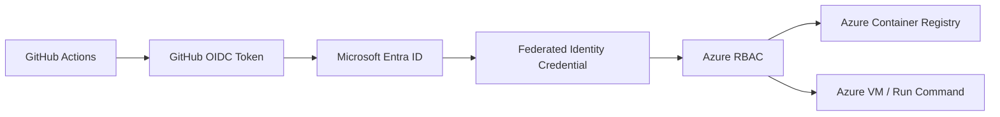
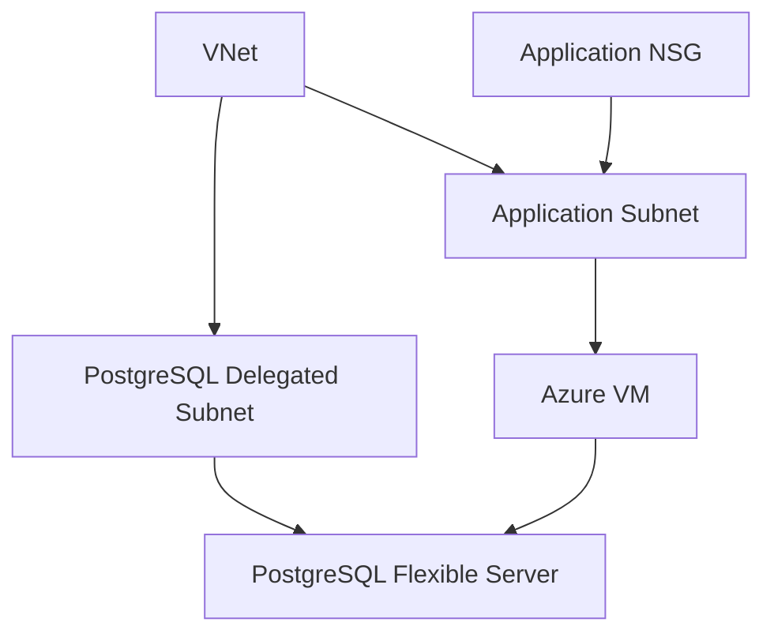
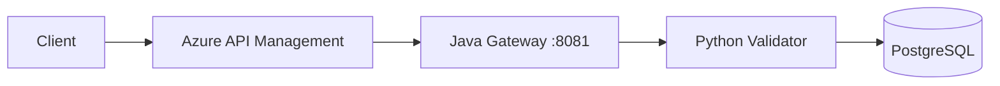
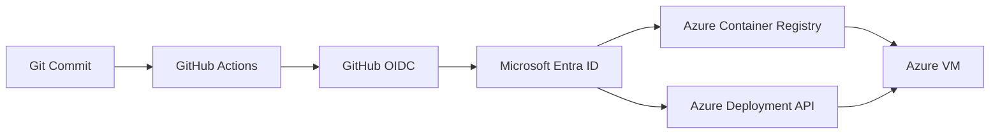
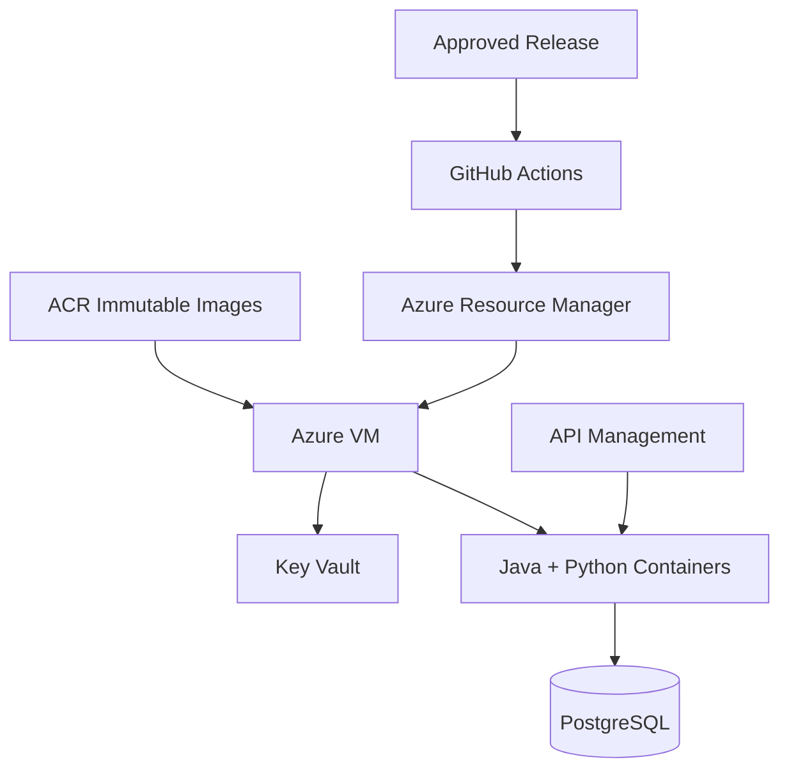
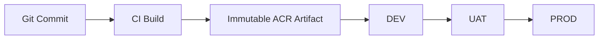
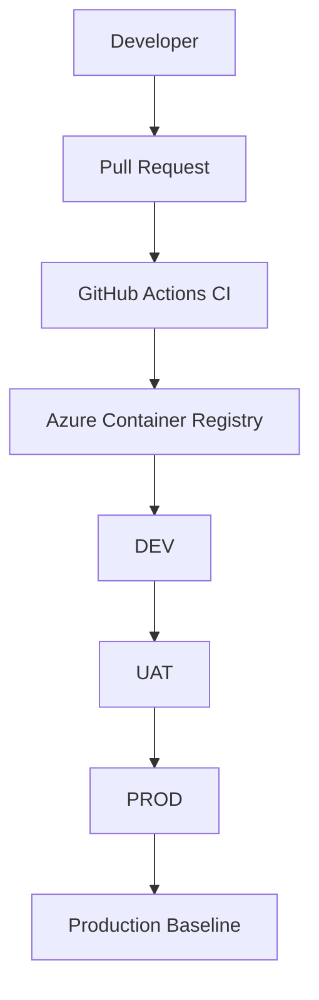

# Deployment Guide

This document describes how to deploy this project to an independent Microsoft Azure environment. It assumes the repository has been cloned and the local quickstart in [`README.md`](../README.md) has been verified. Design rationale is documented in [`ARCHITECTURE_AZURE.md`](ARCHITECTURE_AZURE.md) and is not repeated here.

## Environment lifecycle model

DEV, UAT and PROD are structurally identical deployments of the same Terraform configuration, each provisioned separately and persistently — all three coexist in Azure at the same time, each in its own resource group with its own compute, database, and Key Vault. Promoting from one environment to the next means deploying the same immutable container image digest to the next environment's HCP Terraform workspace; it never involves destroying or recreating another environment's infrastructure or data. This document describes the shape of a single environment, which is identical in structure across DEV, UAT, and PROD.

This three-coexisting-environment approach is the release management strategy used by this reference implementation; it is not a requirement of the underlying architecture. See `ARCHITECTURE_AZURE.md`, Design Principle 12, for why a third party adopting this project is free to substitute a different strategy (environment-per-branch, GitOps continuous deployment, canary/blue-green within a single environment, or a single continuously-updated environment) without changing the identity, network, or secret-handling decisions documented elsewhere in this guide.

## Prerequisites

| Requirement | Notes |
|---|---|
| Azure subscription | A subscription with permission to create the resources defined by Terraform |
| Microsoft Entra tenant | Used for human access, workload identities and Azure RBAC |
| GitHub repository | Actions and Environments must be enabled |
| HCP Terraform account and organization | Used as the Terraform state/control plane where applicable |
| Azure CLI | Current supported Azure CLI version |
| Terraform CLI | `>= 1.5.0` |
| Docker and Docker Compose | Required for local verification |
| Java | Required for local application build/test |
| Python | Required for local application build/test |

## Placeholder Reference

Every deployment-specific command and configuration should use the placeholders below. Replace all occurrences before executing the corresponding step.

| Placeholder | Example value | How to obtain it |
|---|---|---|
| `<AZURE_TENANT_ID>` | `00000000-0000-0000-0000-000000000000` | Azure portal → Microsoft Entra ID → Overview |
| `<AZURE_SUBSCRIPTION_ID>` | `00000000-0000-0000-0000-000000000000` | `az account show --query id --output tsv` |
| `<AZURE_LOCATION>` | `centralindia` | Azure region selected for the deployment |
| `<AZURE_RESOURCE_GROUP>` | `rg-eai-dev` | Resource-group name for one environment. A separate resource group is used per environment (`rg-eai-dev`, `rg-eai-uat`, `rg-eai-prod`); all three exist and run concurrently — see the environment lifecycle note above |
| `<AZURE_ACR_NAME>` | `eaiProjectAcr` | Globally unique Azure Container Registry name |
| `<AZURE_KEY_VAULT_NAME>` | `eai-project-kv` | Globally unique Key Vault name |
| `<AZURE_VM_NAME>` | `eai-project-host` | Azure VM name selected for the deployment |
| `<AZURE_VM_IDENTITY_NAME>` | `eai-vm-identity` | User-assigned or system-assigned identity name, depending on implementation |
| `<AZURE_POSTGRES_SERVER>` | `eai-smart-meter-db` | PostgreSQL Flexible Server name |
| `<AZURE_DATABASE_NAME>` | `smart_meter_warehouse` | PostgreSQL database name |
| `<AZURE_APIM_NAME>` | `eai-project-api` | API Management service name |
| `<AZURE_APIM_API_NAME>` | `enterprise-integration` | API Management API name |
| `<GITHUB_ORG>` | `example-org` | GitHub owner of the repository |
| `<REPO_NAME>` | `enterprise-integration-azure` | GitHub repository name. This repository is independent of any other cloud implementation of this project — if a differently-clouded implementation is also deployed under the same GitHub account, choose a distinct name for each (e.g. `enterprise-integration-azure` here, `enterprise-integration-aws` for an AWS implementation) to avoid a name collision |
| `<HCP_TERRAFORM_ORG>` | `example-org` | HCP Terraform organization |
| `<HCP_TERRAFORM_WORKSPACE>` | `eai-azure-dev` (and `eai-azure-uat`, `eai-azure-prod`) | HCP Terraform workspace — one per environment (Environments, below). If a differently-clouded implementation shares the same HCP Terraform organization, workspace names must still be unique within it; a cloud-specific prefix (as shown here) avoids a collision with an AWS implementation's own workspace |
| `<AZURE_GITHUB_CLIENT_ID>` | `00000000-0000-0000-0000-000000000000` | Application/service-principal identity used by GitHub Actions |
| `<AZURE_TERRAFORM_CLIENT_ID>` | `00000000-0000-0000-0000-000000000000` | Application/service-principal identity used by HCP Terraform |
| `<AZURE_VM_PUBLIC_IP>` | `203.0.113.10` | Terraform output or Azure CLI after VM provisioning |
| `<AZURE_POSTGRES_FQDN>` | `eai-smart-meter-db.postgres.database.azure.com` | Terraform output or Azure CLI after PostgreSQL provisioning |

---

## Phase 0 — Local Development Verification

This phase confirms that the application layer works independently of Azure resources.

The existing development Docker Compose file should remain the local-development entry point. It should provide the Java gateway, Python transformation API and local PostgreSQL dependency required by the application.

**Verify:**

```bash
docker compose -f docker-compose.dev.yml up --build -d
docker compose -f docker-compose.dev.yml ps
curl http://localhost:8081/health
```

```powershell
# PowerShell equivalent
docker compose -f docker-compose.dev.yml up --build -d
docker compose -f docker-compose.dev.yml ps
Invoke-RestMethod -Uri http://localhost:8081/health
```

**Expected result:** the application services report `running` or `healthy`, and the health endpoint returns the expected application health response.

Stop the local stack before continuing:

```bash
docker compose -f docker-compose.dev.yml down
```

---

# Phase 1 — Azure Identity and Bootstrap

Azure deployment separates human identities, GitHub Actions workload identity and Terraform workload identity. Long-lived client secrets should not be placed in GitHub Actions or Terraform configuration.

## 1.1 Azure CLI authentication

Authenticate with an authorized Azure identity:

```bash
az login
az account list --output table
az account set --subscription <AZURE_SUBSCRIPTION_ID>
az account show --output table
```

The selected subscription must be verified before any Terraform operation is executed.

For a tenant-specific login:

```bash
az login --tenant <AZURE_TENANT_ID>
```

Verify the effective identity:

```bash
az account show --query '{subscription:id,tenant:tenantId,user:user.name}' --output json
```

## 1.2 Resource provider registration

The subscription must have the resource providers required by the Terraform configuration registered. Typical providers for this project include:

```bash
az provider register --namespace Microsoft.Compute
az provider register --namespace Microsoft.Network
az provider register --namespace Microsoft.ContainerRegistry
az provider register --namespace Microsoft.KeyVault
az provider register --namespace Microsoft.DBforPostgreSQL
az provider register --namespace Microsoft.ApiManagement
az provider register --namespace Microsoft.ManagedIdentity
az provider register --namespace Microsoft.OperationalInsights
```

Verification:

```bash
az provider show --namespace Microsoft.Compute --query registrationState --output tsv
az provider show --namespace Microsoft.Network --query registrationState --output tsv
az provider show --namespace Microsoft.ContainerRegistry --query registrationState --output tsv
az provider show --namespace Microsoft.KeyVault --query registrationState --output tsv
az provider show --namespace Microsoft.DBforPostgreSQL --query registrationState --output tsv
az provider show --namespace Microsoft.ApiManagement --query registrationState --output tsv
```

Each required provider should report `Registered` before provisioning proceeds.

## 1.3 Resource group

The normal infrastructure configuration should create the resource group through Terraform. The Azure CLI can be used to confirm whether the target group already exists:

```bash
az group show --name <AZURE_RESOURCE_GROUP> --output table
```

Do not create a second resource group manually if the Terraform configuration is intended to own it.

## 1.4 GitHub Actions workload identity

The deployment identity is represented by a Microsoft Entra application/service principal with a federated identity credential for the GitHub repository and the permitted deployment context.

The resulting identity is granted only the Azure RBAC permissions required by the deployment workflow.

Conceptually:



The repository-specific subject and audience values must be configured in the federated credential. They must not be replaced with a broad wildcard that permits unrelated repositories or branches.

## 1.5 HCP Terraform workload identity

Where HCP Terraform executes Terraform remotely, its workload identity must likewise authenticate to Azure through Microsoft Entra federation and Azure RBAC.

The HCP Terraform workspace should contain the Azure provider authentication variables appropriate to the selected federation model. The exact variables depend on whether the configuration uses an application/service principal, workload identity federation, or another supported HCP Terraform authentication mechanism.

The identity should be scoped to the Terraform resources required by the workspace and should not be granted subscription-wide ownership without justification.

---

# Phase 2 — Azure Infrastructure Provisioning

The Azure Terraform root should contain the resource definitions represented by the architecture document.

A typical project structure is:

```text
infra/
├── main.tf
├── resource-group.tf
├── networking.tf
├── compute.tf
├── identity.tf
├── acr.tf
├── key-vault.tf
├── postgresql.tf
└── api-management.tf
```

The bootstrap identity configuration, if present, remains a separate Terraform root from the normal infrastructure configuration.

## 2.1 Terraform initialization

Run from the Terraform root:

```bash
cd infra
terraform init
terraform fmt -check
terraform validate
```

PowerShell:

```powershell
cd infra
terraform init
terraform fmt -check
terraform validate
```

## 2.2 Azure provider configuration

The provider should obtain authentication through the configured Azure workload identity mechanism rather than embedding credentials in the repository.

Example structure:

```hcl
terraform {
  required_version = ">= 1.5.0"

  required_providers {
    azurerm = {
      source  = "hashicorp/azurerm"
      version = "~> 4.0"
    }
  }
}

provider "azurerm" {
  features {}
}
```

The exact provider version should be pinned according to the repository's tested version policy.

## 2.3 Resource group

The resource group is the primary Azure resource boundary for the project.

Example:

```hcl
resource "azurerm_resource_group" "eai" {
  name     = var.resource_group_name
  location = var.location

  tags = var.tags
}
```

## 2.4 Networking

The target network contains an application subnet and a delegated PostgreSQL subnet.

Example logical structure:



The application subnet must allow only the traffic required by the deployment and runtime model. PostgreSQL must not be exposed directly to the Internet.

## 2.5 Azure Container Registry

Two application repositories are expected:

```text
eai-java-gateway
eai-python-validator
```

Images should be tagged with an immutable build identifier such as the Git commit SHA. Repositories should set an immutable tag policy so a re-push of an already-published tag is rejected rather than silently overwritten; the CI workflow's push step must therefore check whether the current commit's tag already exists (for example, via `az acr repository show-tags`) and skip the rebuild/push when it does, so a re-run or a fast-forward merge that reaches CI twice does not fail the pipeline.

Example Terraform resource:

```hcl
resource "azurerm_container_registry" "eai" {
  name                = var.acr_name
  resource_group_name = azurerm_resource_group.eai.name
  location            = azurerm_resource_group.eai.location
  sku                 = "Basic"
  admin_enabled       = false

  # Rejects re-pushing an existing tag outright rather than overwriting it,
  # matching the immutable-artifact principle in ARCHITECTURE_AZURE.md.
  trust_policy {
    enabled = false
  }
}
```

The runtime VM should authenticate to ACR through its managed identity rather than a stored registry password.

## 2.6 Key Vault

Key Vault stores environment secrets such as the database password and application security token. Both values are generated by Terraform, written directly to Key Vault, and never appear in source control, workflow YAML, or this document in populated form.

Example generation and storage pattern:

```hcl
resource "random_password" "postgres_admin" {
  length  = 24
  special = false
}

resource "random_password" "api_security_token" {
  length  = 32
  special = false
}

resource "azurerm_key_vault_secret" "database_password" {
  name         = "database-password"
  value        = random_password.postgres_admin.result
  key_vault_id = azurerm_key_vault.eai.id
}

resource "azurerm_key_vault_secret" "api_security_token" {
  name         = "api-security-token"
  value        = random_password.api_security_token.result
  key_vault_id = azurerm_key_vault.eai.id
}
```

The application VM identity should receive only the secret access required by the application (`Key Vault Secrets User` scoped to this Key Vault, not a broader Key Vault role).

Example secret inventory:

```text
database-password
api-security-token
```

Each environment (DEV, UAT, PROD) uses its own Key Vault instance and its own generated secret values; a password or token is never copied between environments. Secret values must not be committed to Terraform files, GitHub workflow YAML, Docker Compose files or repository documentation.

## 2.7 PostgreSQL Flexible Server

The PostgreSQL server should use private networking through the delegated database subnet and the associated private DNS configuration.

The application database should be created separately from the server where required by the Terraform design.

The deployment should record the resulting PostgreSQL FQDN as `<AZURE_POSTGRES_FQDN>`.

## 2.8 Azure VM

The VM hosts the Java and Python containers and uses a managed identity for Azure resource access.

The VM should not require a long-lived Azure service-principal secret for:

- ACR image pulls
- Key Vault access
- Azure management operations performed through the managed identity

Where VM Run Command is used, the deployment identity invokes commands through Azure Resource Manager rather than storing SSH credentials in GitHub Actions.

The VM's network security group defines no inbound SSH rule and no SSH key pair is provisioned for the VM. When an interactive operator session is required for troubleshooting (as opposed to the automated deployment path above), it is established through Azure Bastion, authorized by the operator's own Azure RBAC role assignment rather than a distributed credential.

## 2.9 API Management

API Management is the public API boundary.

The API should route to the Java gateway backend on the configured application endpoint.

Conceptually:



The API Management configuration should expose only the intended public API surface. Internal application services should not become independently public endpoints.

## 2.10 Plan and apply

Review the proposed infrastructure change:

```bash
terraform plan
```

Apply only after the plan has been reviewed:

```bash
terraform apply
```

For a remote HCP Terraform workspace, the equivalent plan/apply operation is executed by the configured workspace rather than from the local machine.

## 2.11 Record outputs

Record the outputs required by CI/CD and deployment operations, for example:

```bash
terraform output
```

Typical values include:

```text
resource_group_name
acr_login_server
vm_id
vm_public_ip
postgresql_fqdn
api_management_gateway_url
```

Do not place secret output values into GitHub repository variables or documentation unless the value is explicitly non-secret.

---

# Phase 3 — CI/CD Pipeline

The CI/CD workflow should preserve the following quality gates:

```text
Source
  ↓
Secret scan
  ↓
Java build/test
  ↓
Python build/test
  ↓
Dependency / IaC scan
  ↓
Docker build
  ↓
Container image scan
  ↓
Push immutable images to ACR
  ↓
Deploy approved artifact
```

## 3.1 Production Docker Compose definition

The production Compose definition should pull images from ACR rather than build them on the VM.

Example structure:

```yaml
networks:
  eai-mesh:
    driver: bridge

services:
  python-validator:
    image: ${ACR_REGISTRY}/eai-python-validator:${IMAGE_TAG}
    restart: always
    environment:
      API_SECURITY_TOKEN: ${API_SECURITY_TOKEN}
      DATABASE_URL: ${DATABASE_URL}
    networks:
      - eai-mesh

  java-gateway:
    image: ${ACR_REGISTRY}/eai-java-gateway:${IMAGE_TAG}
    restart: always
    environment:
      SERVER_PORT: "8081"
      INTEGRATION_PYTHON_BASE-URL: http://python-validator:<PYTHON_INTERNAL_PORT>
      INTEGRATION_PYTHON_AUTH-TOKEN: ${API_SECURITY_TOKEN}
    ports:
      - "8081:8081"
    depends_on:
      - python-validator
    networks:
      - eai-mesh
```

The exact Python internal port must match the application configuration used by the repository.

## 3.2 GitHub Actions Azure authentication

The workflow should use GitHub OIDC and Azure federated identity rather than a stored client secret.

Conceptual workflow:



The workflow should request only the permissions it requires. At minimum, the workflow's GitHub permissions should explicitly allow `id-token: write` for OIDC and `contents: read` for source checkout.

## 3.3 Image tagging

Images should be built once and tagged with the immutable Git commit SHA:

```text
<ACR_REGISTRY>/eai-java-gateway:<GIT_SHA>
<ACR_REGISTRY>/eai-python-validator:<GIT_SHA>
```

The release process should record the resulting ACR image digests.

## 3.4 GitHub repository configuration

Repository variables should contain non-secret deployment metadata, for example:

| Variable | Value |
|---|---|
| `AZURE_CLIENT_ID` | `<AZURE_GITHUB_CLIENT_ID>` |
| `AZURE_TENANT_ID` | `<AZURE_TENANT_ID>` |
| `AZURE_SUBSCRIPTION_ID` | `<AZURE_SUBSCRIPTION_ID>` |
| `AZURE_RESOURCE_GROUP` | `<AZURE_RESOURCE_GROUP>` |
| `AZURE_ACR_NAME` | `<AZURE_ACR_NAME>` |
| `AZURE_VM_NAME` | `<AZURE_VM_NAME>` |

Environment-specific values should be placed at the GitHub Environment level when the workflow requires different values for DEV, UAT and PROD.

Secrets should contain only values that genuinely need secret treatment.

## 3.5 GitHub Environments

Create the environments required by the repository's release model:

```text
dev
uat
prod
```

DEV deployment should be automatic after the defined CI gates pass. UAT deployment should be protected by an approval gate. Production deployment should be protected by a separate required-reviewer approval gate and appropriate deployment restrictions.

## 3.6 Commit the deployment configuration

```bash
git add .github/workflows/ci.yml infra/docker-compose.prod.yml
git commit -m "ci: build, scan, publish and deploy Azure application images"
git push origin <branch-name>
```

---

# Phase 4 — Deployment and Verification

## 4.1 Deploy the application

The deployment workflow should:

1. Authenticate to Azure through GitHub OIDC.
2. Resolve the exact image tag/digest being deployed.
3. Invoke the configured Azure VM deployment mechanism.
4. Authenticate the VM to ACR using its managed identity.
5. Pull the exact Java and Python images.
6. Obtain runtime secrets from Key Vault through the VM managed identity.
7. Start or replace the application containers.
8. Verify container health.
9. Verify the API through API Management.

Conceptual flow:



## 4.2 Verify VM state

```bash
az vm show \
  --resource-group <AZURE_RESOURCE_GROUP> \
  --name <AZURE_VM_NAME> \
  --show-details \
  --output table
```

## 4.3 Verify containers

Where VM Run Command is the configured deployment mechanism:

```bash
az vm run-command invoke \
  --resource-group <AZURE_RESOURCE_GROUP> \
  --name <AZURE_VM_NAME> \
  --command-id RunShellScript \
  --scripts "docker compose -f /opt/eai/docker-compose.prod.yml ps"
```

The command output should show both application containers in the expected state.

## 4.4 Verify API Management

Use the API Management gateway URL produced by Terraform:

```bash
curl https://<APIM_GATEWAY_HOST>/health
```

The health response should match the application's documented health contract.

## 4.5 Verify database connectivity

Database connectivity should be verified indirectly through the application health or integration endpoint unless direct administrative database access is explicitly required.

The PostgreSQL server should remain private and should not be made publicly accessible merely to simplify this test.

## 4.6 Verify ACR image identity

The deployed image identity should be recorded by digest.

Example CLI inspection:

```bash
az acr repository show-manifests \
  --name <AZURE_ACR_NAME> \
  --repository eai-java-gateway \
  --output table
```

The corresponding Python image must also be recorded.

## 4.7 Verify Key Vault access

The VM managed identity should be able to access only the secrets assigned to the application.

Administrative verification should be performed from an authorized Azure identity rather than embedding Key Vault credentials in the application container.

---

# Phase 5 — Release and Rollback

## 5.1 Release identity

A release should identify at least:

```text
Git commit
Git tag / release
Java image tag
Java image digest
Python image tag
Python image digest
Database migration level
Terraform commit/version
Deployment workflow run
Environment
Deployment timestamp
```

## 5.2 Build once, promote many

The same immutable image should be promoted through environments:



The promotion operation must not rebuild the application from source.

## 5.3 Rollback

Rollback should select the previous validated image digest and redeploy that artifact.

Example conceptual state:

```text
Current:
  java  @sha256:CURRENT
  python @sha256:CURRENT

Rollback:
  java  @sha256:PREVIOUS
  python @sha256:PREVIOUS
```

A database rollback must be treated separately because database migrations may not be safely reversible.

---

# Phase 6 — Production Baseline

After a successful production deployment, record the production baseline.

Example:

```yaml
release:
  version: "<RELEASE_VERSION>"
  git_commit: "<GIT_COMMIT>"
  git_tag: "<GIT_TAG>"

artifacts:
  java:
    repository: "eai-java-gateway"
    digest: "sha256:<JAVA_DIGEST>"
  python:
    repository: "eai-python-validator"
    digest: "sha256:<PYTHON_DIGEST>"

database:
  migration: "<DATABASE_MIGRATION>"

infrastructure:
  terraform_commit: "<TERRAFORM_COMMIT>"

deployment:
  environment: "production"
  workflow_run: "<GITHUB_WORKFLOW_RUN>"
  deployed_at: "<DEPLOYMENT_TIMESTAMP>"
```

The baseline should be retained as the authoritative record of the production configuration.

---

# Troubleshooting Reference

## Azure CLI identity

```bash
az account show
az account get-access-token
```

## Subscription mismatch

```bash
az account list --output table
az account set --subscription <AZURE_SUBSCRIPTION_ID>
```

## Terraform authentication

```bash
az account show
terraform init
terraform validate
terraform plan
```

The effective Terraform authentication method must match the authentication mechanism configured for the environment. A successful `az login` does not automatically prove that an HCP Terraform remote run has valid Azure credentials.

## ACR access

```bash
az acr show --name <AZURE_ACR_NAME> --resource-group <AZURE_RESOURCE_GROUP> --output table
az acr login --name <AZURE_ACR_NAME>
```

`az acr login` is an operator diagnostic. The production VM should use its managed identity rather than an administrator credential.

## VM Run Command

```bash
az vm run-command invoke \
  --resource-group <AZURE_RESOURCE_GROUP> \
  --name <AZURE_VM_NAME> \
  --command-id RunShellScript \
  --scripts "docker ps"
```

## Interactive VM access via Bastion

```bash
az network bastion ssh \
  --name <AZURE_BASTION_NAME> \
  --resource-group <AZURE_RESOURCE_GROUP> \
  --target-resource-id <AZURE_VM_RESOURCE_ID> \
  --auth-type AAD
```

This requires the operator to hold an Azure RBAC role permitting Bastion connection to the target VM. No SSH key pair or password is used; authentication is through the operator's own Microsoft Entra session.

## PostgreSQL

```bash
az postgres flexible-server show \
  --resource-group <AZURE_RESOURCE_GROUP> \
  --name <AZURE_POSTGRES_SERVER> \
  --output table
```

## API Management

```bash
az apim show \
  --resource-group <AZURE_RESOURCE_GROUP> \
  --name <AZURE_APIM_NAME> \
  --output table
```

---

# Security Rules

1. Do not commit Azure client secrets, passwords, tokens or private keys.
2. Use Microsoft Entra ID and workload identity federation for CI/CD authentication.
3. Use managed identity for VM-to-Azure authentication.
4. Use Key Vault for application secrets.
5. Keep PostgreSQL private.
6. Do not grant GitHub Actions subscription-wide `Owner` or unrestricted `Contributor` access merely to simplify deployment.
7. Restrict federated identity credentials to the intended repository and deployment context.
8. Use immutable container image identifiers for production deployments.
9. Protect the production GitHub Environment with explicit approval.
10. Record the production baseline after deployment.
11. Keep infrastructure state outside the Git repository when using remote Terraform state.
12. Do not expose internal application services merely to simplify diagnostics.

---

# Appendix A — Azure CLI Command Summary

```bash
az login
az account list --output table
az account set --subscription <AZURE_SUBSCRIPTION_ID>
az account show

az provider show --namespace Microsoft.Compute --query registrationState --output tsv
az provider show --namespace Microsoft.Network --query registrationState --output tsv

cd infra
terraform init
terraform fmt -check
terraform validate
terraform plan
terraform apply

az vm show --resource-group <AZURE_RESOURCE_GROUP> --name <AZURE_VM_NAME> --show-details --output table
az acr show --name <AZURE_ACR_NAME> --resource-group <AZURE_RESOURCE_GROUP> --output table
az postgres flexible-server show --resource-group <AZURE_RESOURCE_GROUP> --name <AZURE_POSTGRES_SERVER> --output table
az apim show --resource-group <AZURE_RESOURCE_GROUP> --name <AZURE_APIM_NAME> --output table
```

---

# Appendix B — Deployment Responsibility Summary

| Component | Deployment responsibility |
|---|---|
| GitHub | Source control, pull requests, workflow execution and deployment approvals |
| GitHub Actions | Build, test, scan, publish and invoke deployment |
| Microsoft Entra ID | Human and workload identity authentication |
| Azure RBAC | Authorization for Azure resources |
| HCP Terraform | Terraform execution/state control plane, where configured |
| Azure Resource Manager | Azure resource management and VM Run Command invocation |
| Azure Container Registry | Immutable application container artifacts |
| Azure Key Vault | Runtime secrets |
| Azure VM | Application container runtime |
| Azure Bastion | RBAC-authorized interactive operator access; no public SSH |
| PostgreSQL Flexible Server | Application database |
| API Management | Public API boundary |

---

# Appendix C — Expected Deployment Flow


