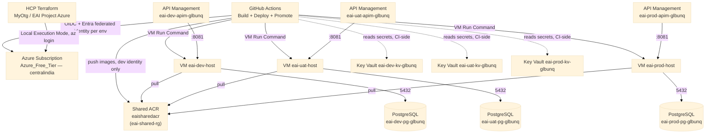
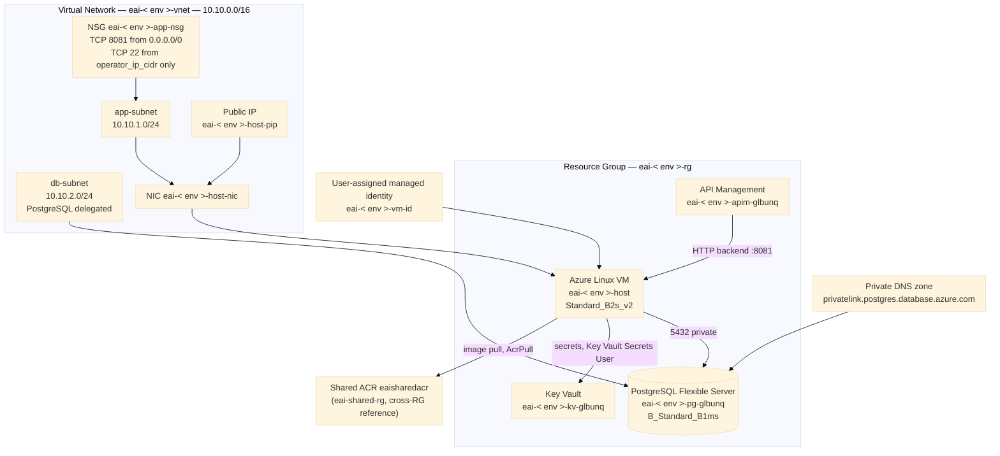
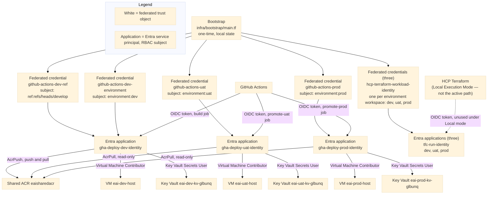
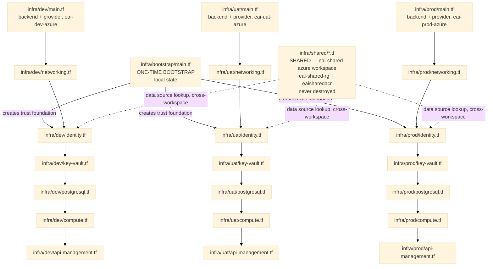

# INFRA_VIEW — Understand the Infrastructure (Azure Implementation)

This view is intentionally split into four layers. Read them in order: **Big Picture → Azure Infrastructure → Identity / Deployment → Terraform Map**.

Resource names, Terraform resource types, source files, and usage relationships throughout this document are those of the reference implementation. Account-specific identifiers (tenant, subscription, repository and application IDs) appear only as placeholders — see `ARCHITECTURE_AZURE.md`, Section 8, for the identifier inventory.

---

# 1. Big Picture — How Everything Works



### The story in plain English

1. **HCP Terraform** provides remote state storage for four workspaces — one per environment plus one shared workspace — under Local Execution Mode. Every actual `plan`/`apply` runs from the operator's own machine, authenticated by an interactive `az login` session, not by HCP Terraform's own workload identity.
2. **GitHub Actions** builds the application images once, on Development, and pushes them to the single shared Container Registry. It deploys to Development automatically on push; promotion to UAT and to Production is triggered manually via `workflow_dispatch`.
3. **API Management**, one instance per environment, is the public HTTP entry point for that environment and proxies requests to its own VM's public IP on port `8081`.
4. **Each environment's VM** hosts the application containers. Its managed identity pulls both application images from the shared registry and reads that environment's own Key Vault secrets at runtime; the deployment secrets themselves are resolved by the GitHub Actions job, not the VM, at deploy time — see Section 3.
5. **Each environment's VM** connects to its own private PostgreSQL Flexible Server on port `5432`.
6. **Only one Container Registry exists across all three environments** — `eaisharedacr`, in its own resource group, never destroyed as part of any environment's lifecycle.
7. **Development and UAT are not both provisioned simultaneously once Production exists.** A free-tier vCPU quota constraint (`ARCHITECTURE_AZURE.md`, Section 7) forces a cycling model — this is stated explicitly here because it changes what "currently exists" means at any given point in this project's actual history, unlike a steady-state deployment where the diagram above would be literally true of all three environments at once.

---

# 2. Azure Infrastructure — What Exists Per Environment

The three environments are structurally identical; one representative environment is shown in full below. Differences that do exist between environments (identifiers only, never shape) are called out in the resource inventory table.



## Important network facts

- Azure has no direct equivalent of an AWS Internet Gateway resource; public/private connectivity is represented instead through Public IP resources, NSG rules, and (for the database subnet) private DNS zone linkage.
- `app-subnet` carries the VM's NIC; `db-subnet` is delegated to `Microsoft.DBforPostgreSQL/flexibleServers` and carries no VM.
- Each environment's VNet uses the address space `10.10.0.0/16`; because each environment sits in its own resource group with no VNet peering between environments, the three VNets do not need distinct CIDR ranges to avoid a routing conflict — this is a genuine, intentional divergence from a design where all three environments would share a hub network.
- The database's PostgreSQL Flexible Server has `public_network_access_enabled = false` set explicitly in every environment; private reachability depends on the delegated subnet and the private DNS zone link together, not on the setting's default.

## Azure resource inventory

| Azure entity | Terraform resource | Development | UAT | Production | Defined in |
|---|---|---|---|---|---|
| Resource Group | `azurerm_resource_group` | `eai-dev-rg` | `eai-uat-rg` | `eai-prod-rg` | `infra/<env>/main.tf` |
| Virtual Network | `azurerm_virtual_network` | `eai-dev-vnet` | `eai-uat-vnet` | `eai-prod-vnet` | `infra/<env>/networking.tf` |
| Application Subnet | `azurerm_subnet.app` | `app-subnet` (`10.10.1.0/24`) | same | same | `infra/<env>/networking.tf` |
| Database Subnet | `azurerm_subnet.db` | `db-subnet` (`10.10.2.0/24`, delegated) | same | same | `infra/<env>/networking.tf` |
| Network Security Group | `azurerm_network_security_group.app` | `eai-dev-app-nsg` | `eai-uat-app-nsg` | `eai-prod-app-nsg` | `infra/<env>/networking.tf` |
| Public IP | `azurerm_public_ip.vm` | `eai-dev-host-pip` | `eai-uat-host-pip` | `eai-prod-host-pip` | `infra/<env>/networking.tf` |
| VM NIC | `azurerm_network_interface.vm` | `eai-dev-host-nic` | `eai-uat-host-nic` | `eai-prod-host-nic` | `infra/<env>/networking.tf` |
| Managed Identity | `azurerm_user_assigned_identity.vm` | `eai-dev-vm-id` | `eai-uat-vm-id` | `eai-prod-vm-id` | `infra/<env>/identity.tf` |
| Azure VM | `azurerm_linux_virtual_machine` | `eai-dev-host` | `eai-uat-host` | `eai-prod-host` | `infra/<env>/compute.tf` |
| Key Vault | `azurerm_key_vault` | `eai-dev-kv-glbunq` | `eai-uat-kv-glbunq` | `eai-prod-kv-glbunq` | `infra/<env>/key-vault.tf` |
| PostgreSQL Flexible Server | `azurerm_postgresql_flexible_server` | `eai-dev-pg-glbunq` | `eai-uat-pg-glbunq` | `eai-prod-pg-glbunq` | `infra/<env>/postgresql.tf` |
| Private DNS Zone | `azurerm_private_dns_zone` | `privatelink.postgres.database.azure.com` (own instance per environment) | same shape | same shape | `infra/<env>/postgresql.tf` |
| API Management | `azurerm_api_management` | `eai-dev-apim-glbunq` | `eai-uat-apim-glbunq` | `eai-prod-apim-glbunq` | `infra/<env>/api-management.tf` |
| Container Registry (shared, not per-environment) | `azurerm_container_registry.eai_acr` | `eaisharedacr` (single instance, `eai-shared-rg`, workspace `eai-shared-azure`) | | | `infra/shared/acr.tf` |
| Azure Bastion (superseded, not provisioned) | `azurerm_bastion_host` | Commented out in all three environments | | | `infra/<env>/bastion.tf` |

# 3. Identity / Deployment — Who Can Do What



## The crucial Azure identity distinction

**Three separate Entra applications exist for GitHub Actions, not one application with three federated credentials.**

- `infra/bootstrap/main.tf` creates `gha-deploy-dev-identity`, `gha-deploy-uat-identity`, and `gha-deploy-prod-identity` as three distinct `azuread_application` / `azuread_service_principal` resource pairs.
- Each environment's own Terraform (`infra/<env>/identity.tf`) then grants RBAC role assignments to the matching application's service principal, looked up by its already-known client ID.
- Azure RBAC is scoped to the **service principal**, not to which federated credential authenticated a given token. One shared application with three federated credentials (one per environment's subject) would mean any RBAC grant made to that single principal is usable by a token obtained under any of the three subjects — collapsing the per-environment isolation this design requires. Three separate principals, each with its own narrow RBAC grants, is what actually enforces the isolation.

**The Development identity alone needs two federated credentials on one application**, because Entra federated credentials match exactly one subject string each — there is no array-based wildcard matching equivalent to an AWS IAM trust policy's `StringLike` condition list:

| Federated credential | Subject | Matches |
|---|---|---|
| `github-actions-dev-ref` | `repo:<GITHUB_ORG>@<GITHUB_OWNER_ID>/<REPO_NAME>@<GITHUB_REPO_ID>:ref:refs/heads/develop` | The build/push job — no `environment:` key declared, triggered by a plain push |
| `github-actions-dev-environment` | `repo:<GITHUB_ORG>@<GITHUB_OWNER_ID>/<REPO_NAME>@<GITHUB_REPO_ID>:environment:dev` | The `deploy-dev` job — declares `environment: dev`, receives an environment-shaped claim regardless of branch |

UAT and Production each need only one federated credential apiece, since `promote-uat` and `promote-prod` are exclusively `workflow_dispatch`-triggered and always declare their `environment:` key — there is no equivalent push-triggered build job on either branch to also account for.

**Note on the subject format.** Subjects follow the pattern `repo:<owner_name>@<owner_id>/<repository_name>@<repository_id>:<ref-or-environment>`.

The numeric identifiers are read from the GitHub REST API response for `https://api.github.com/repos/<GITHUB_ORG>/<REPO_NAME>`: the top-level `id` field is `<GITHUB_REPO_ID>`, and the `owner.id` field is `<GITHUB_OWNER_ID>`.

### GitHub Actions permissions by identity

**`gha-deploy-dev-identity` grants:**
- `AcrPush` on `eaisharedacr` (the only one of the three identities with push access, since only Development builds); the built-in `AcrPush` role also includes pull rights, so no separate `AcrPull` assignment exists for this identity
- `Virtual Machine Contributor` on `eai-dev-host` (authorizes Run Command invocation)
- `Key Vault Secrets User` on `eai-dev-kv-glbunq`

**`gha-deploy-uat-identity` and `gha-deploy-prod-identity` each grant:**
- `AcrPull` only, on `eaisharedacr` — sufficient for the promotion workflow's tag-existence confirmation step (`az acr repository show`), never for a push
- `Virtual Machine Contributor` on their own environment's VM only
- `Key Vault Secrets User` on their own environment's Key Vault only

**Why the push grant differs.** Only the Development build job produces images, so only `gha-deploy-dev-identity` holds `AcrPush` (`azurerm_role_assignment.gha_dev_acr_push`). UAT and Production hold `AcrPull` alone, which permits reading and confirming an image but never writing one. *Analogy:* a loading-dock pass (`AcrPush`) also lets its holder collect cargo, whereas a receiving-dock pass (`AcrPull`) permits collection only.

### VM managed identity permissions (per environment)

Each environment's user-assigned managed identity (`eai-<env>-vm-id`) grants:
- `AcrPull` on the shared registry `eaisharedacr`
- `Key Vault Secrets User` on that environment's own Key Vault only

### Key Vault secret retrieval happens on the GitHub Actions side, not the VM side

This is a deliberate divergence worth stating plainly, since a design assuming VM-side secret retrieval (the more common managed-identity pattern) would misread the deployment flow: the `deploy-dev` / `promote-uat` / `promote-prod` jobs each call `az keyvault secret show` directly from the GitHub Actions runner, authenticated as their own environment's `gha-deploy-*-identity` under its `Key Vault Secrets User` grant — not from inside the VM via its managed identity. The resolved secret values are written into the VM's `.env` file as part of the same Run Command script that deploys the containers. The VM's own managed identity separately holds `Key Vault Secrets User` on its own vault, but this grant is not exercised by the deployment path itself; it exists for any runtime use outside deployment. This keeps the Run Command script simpler, at the cost of the GitHub Actions job's own identity needing broader reach than a purely VM-centric design would require.

### HCP Terraform identity

Bootstrap creates three `tfc-run-identity` applications (`tfc_run_dev`, `tfc_run_uat`, `tfc_run_prod`; identical display names), each with one federated credential scoped to a single environment's workspace: `organization:<HCP_TERRAFORM_ORG>:project:*:workspace:<that environment's workspace>:run_phase:*`. No identity or credential exists for the shared workspace. **No RBAC role assignment is granted to any of these identities anywhere in this project**, because every workspace runs under Local Execution Mode — HCP Terraform never itself executes a plan or apply, so its own workload identity is never actually presented to Azure for anything beyond the identity's own existence. The identities are retained for parity with the equivalent GitHub Actions identity model and become relevant only if a workspace is later switched to Remote or Agent execution mode.

# 4. Terraform Map — Where Is Everything Defined?



## File-by-file map

### `infra/bootstrap/main.tf` — one-time trust foundation

| Terraform entity | Type | Azure resource/name | Used by | Purpose |
|---|---|---|---|---|
| `gha_deploy_dev` | `azuread_application` + `azuread_service_principal` | `gha-deploy-dev-identity` | `infra/dev/identity.tf` (RBAC lookup) | Development deployment identity |
| `gha_deploy_dev_ref` | `azuread_application_federated_identity_credential` | ref-shaped credential | GitHub Actions build/push job | Trusts `develop`-branch pushes with no `environment:` key |
| `gha_deploy_dev` (credential) | `azuread_application_federated_identity_credential` | environment-shaped credential | GitHub Actions `deploy-dev` job | Trusts jobs declaring `environment: dev` |
| `gha_deploy_uat` | `azuread_application` + `azuread_service_principal` + federated credential | `gha-deploy-uat-identity` | `infra/uat/identity.tf` | UAT promotion identity |
| `gha_deploy_prod` | `azuread_application` + `azuread_service_principal` + federated credential | `gha-deploy-prod-identity` | `infra/prod/identity.tf` | Production promotion identity |
| `tfc_run_dev` | `azuread_application` + `azuread_service_principal` + federated credential | `tfc-run-identity` (workspace-scoped: dev) | Not actively consumed (Local Execution Mode) | Parity with the GitHub Actions identity model |
| `tfc_run_uat` | `azuread_application` + `azuread_service_principal` + federated credential | `tfc-run-identity` (workspace-scoped: UAT) | Not actively consumed (Local Execution Mode) | Parity with the GitHub Actions identity model |
| `tfc_run_prod` | `azuread_application` + `azuread_service_principal` + federated credential | `tfc-run-identity` (workspace-scoped: prod) | Not actively consumed (Local Execution Mode) | Parity with the GitHub Actions identity model |

### `infra/shared/*.tf` — the one cross-environment resource

- `main.tf` — HCP Terraform Cloud backend (the shared workspace) and the `azurerm` provider (`~> 4.0`) only
- `resource-group.tf` — `azurerm_resource_group.shared` — `eai-shared-rg`
- `acr.tf` — `azurerm_container_registry.eai_acr` — name from `var.acr_name`, SKU `Basic`, `admin_enabled = false`
- `variables.tf` — input variables (several declared but not consumed by this folder)
- Backed by its own HCP Terraform workspace — deliberately not folded into any environment's state, so no environment's destroy/recreate cycle can ever touch the shared registry
- Outputs: `acr_id`, `acr_login_server` — the environments resolve the registry through a `data "azurerm_container_registry"` lookup, not a Terraform resource reference (the registry lives in a different state file)

### `infra/<env>/main.tf` — backend, providers and resource group, per environment

- HCP Terraform Cloud block: one workspace per environment (reference-deployment examples: `eai-dev-azure` / `eai-uat-azure` / `eai-prod-azure`)
- Providers pinned in `required_providers`: `azurerm` `~> 4.0`, `random` `~> 3.6`, `azuread` `~> 3.0`, `tls` `~> 4.0`; each provider block is declared explicitly. `azurerm` authenticates through the active `az login` session under Local Execution Mode
- The environment's `azurerm_resource_group`
- Declares `data "azurerm_container_registry" "shared"` — the cross-workspace registry lookup

### `infra/<env>/variables.tf` and `terraform.tfvars`

- `variables.tf` declares the environment's inputs: `azure_tenant_id`, `azure_subscription_id` and `gha_deploy_client_id` (all sensitive), `acr_name`, `key_vault_name`, `postgres_server_name`, `apim_name` and `operator_ip_cidr`, together with several bootstrap-derived values (`github_org`, `github_owner_id`, `repo_name`, `github_repo_id`, `hcp_terraform_org`, `hcp_terraform_ws_*`) of which only some are consumed in an environment folder (for example, `github_org` in the API Management publisher e-mail)
- Values are supplied from a local `terraform.tfvars`, which `.gitignore` excludes from version control (a `.sample` file is committed); `operator_ip_cidr` may alternatively be passed on the command line with `-var`
- `operator_ip_cidr` is consumed by `networking.tf`'s `AllowOperatorSSH` rule

### `infra/<env>/networking.tf`

- `azurerm_virtual_network`, `azurerm_subnet.app`, `azurerm_subnet.db` (PostgreSQL-delegated)
- `azurerm_network_security_group.app` — `AllowJavaGateway` (TCP 8081, `0.0.0.0/0`) and `AllowOperatorSSH` (TCP 22, `var.operator_ip_cidr` only)
- `azurerm_public_ip.vm`, `azurerm_network_interface.vm`
- `AzureBastionSubnet` and both Bastion `.tf` resources present only as commented-out blocks — see `ARCHITECTURE_AZURE.md`, Section 6

### `infra/<env>/identity.tf`

- `azurerm_user_assigned_identity.vm` — `eai-<env>-vm-id`
- `azurerm_role_assignment.vm_acr_pull` — `AcrPull` on the shared registry, cross-workspace scope
- `data.azuread_service_principal.gha_deploy_<env>` — looked up by the client ID supplied through `var.gha_deploy_client_id` (recorded from the bootstrap outputs)
- `azurerm_role_assignment.gha_<env>_vm_runcommand` — `Virtual Machine Contributor`, scoped to that environment's VM
- `azurerm_role_assignment.gha_<env>_kv_secrets_user` — `Key Vault Secrets User`, scoped to that environment's Key Vault
- `azurerm_role_assignment.gha_dev_acr_push` — `AcrPush` on the shared registry, Development only; the role includes pull rights, so Development has no separate pull assignment
- `azurerm_role_assignment.gha_uat_acr_pull` and `gha_prod_acr_pull` — `AcrPull` on the shared registry, defined in the UAT and Production folders' `identity.tf` respectively
- Both are granted to the GitHub Actions identity directly, distinct from the VM's own `AcrPull` grant above
- Output: `vm_identity_client_id`

### `infra/<env>/key-vault.tf`

- `azurerm_key_vault` — RBAC-authorized data plane (`rbac_authorization_enabled = true`), not the legacy access-policy model
- `tenant_id` is supplied through `var.azure_tenant_id` rather than hardcoded
- `azurerm_role_assignment.vm_kv_secrets_user`, `azurerm_role_assignment.terraform_kv_secrets_officer` (grants the applying operator's own identity read/write, required to create the two secrets below)
- `random_password.postgres_admin`, `random_password.api_security_token`
- `azurerm_key_vault_secret.database_password`, `azurerm_key_vault_secret.api_security_token`

### `infra/<env>/postgresql.tf`

- `azurerm_private_dns_zone` (`privatelink.postgres.database.azure.com`) + `azurerm_private_dns_zone_virtual_network_link`
- `azurerm_postgresql_flexible_server` — `eai-<env>-pg-glbunq`, version `16`, zone `2`, SKU `B_Standard_B1ms`, `public_network_access_enabled = false`, explicit `depends_on` on the delegated subnet and the DNS zone link
- `azurerm_postgresql_flexible_server_database` — `smart_meter_warehouse`
- Output: `postgres_fqdn`

### `infra/<env>/compute.tf`

- `tls_private_key.vm_unused` — satisfies the resource schema's mandatory auth block only; never distributed or used for actual login
- `azurerm_linux_virtual_machine` — `eai-<env>-host`, size `Standard_B2s_v2`, `disable_password_authentication = true`, `custom_data` bootstrap script (Docker CE from its own apt repository, Azure CLI, unattended-upgrade-timer disabling to avoid `dpkg` lock contention)
- `azurerm_role_assignment.vm_admin_login` — `Virtual Machine Administrator Login` for the operator's own identity
- `azurerm_virtual_machine_extension.aad_login` — `AADSSHLoginForLinux`, the mechanism underlying both the superseded Bastion path and the active `az ssh vm` path
- Outputs: `vm_id`, `vm_public_ip`

### `infra/<env>/api-management.tf`

- `azurerm_api_management` — `eai-<env>-apim-glbunq`, SKU `Consumption_0`
- `azurerm_api_management_api` — `service_url` targets `http://<vm public IP>:8081`
- `azurerm_api_management_api_operation` — explicit per-route operations (`GET /health`, `POST /api/v1/ingest/bulk`), not a wildcard template
- Output: `apim_gateway_url`

---

# 5. End-to-End Flows

## 5.1 Infrastructure provisioning (any environment)

```text
Operator's az login session
     │
     ▼
Local terraform apply (infra/<env>)
     │
     ├── VNet / Subnets / NSG / Public IP / NIC
     ├── Managed Identity + RBAC on shared ACR
     ├── Key Vault + generated secrets
     ├── PostgreSQL Flexible Server (private)
     ├── Virtual Machine + AADSSHLoginForLinux
     └── API Management (depends on VM public IP)
             │
             ▼
     HCP Terraform workspace (state storage only)
```

## 5.2 Image build and Development deployment

```text
Push to develop
     │
     │ GitHub OIDC token
     ▼
gha-deploy-dev-identity (ref-shaped credential)
     │
     ├── Build + scan + push images ──────► eaisharedacr
     │
     ▼ (same push, environment-shaped credential)
gha-deploy-dev-identity (deploy-dev job)
     │
     ├── Read secrets from eai-dev-kv-glbunq (CI-side)
     └── az vm run-command invoke ─────────► eai-dev-host
                                                  │
                                                  ├── docker login (VM's own managed identity)
                                                  ├── pull images from eaisharedacr
                                                  └── docker compose up -d
```

## 5.3 Promotion to UAT or Production (manual dispatch)

```text
Operator: gh workflow run ci.yml --ref <uat|main> -f image_tag=<SHA>
     │
     │ GitHub OIDC token
     ▼
gha-deploy-<uat|prod>-identity
     │
     ├── Confirm image_tag exists in eaisharedacr (AcrPull, read-only — no build)
     ├── Read secrets from that environment's Key Vault (CI-side)
     └── az vm run-command invoke ─────────► eai-<uat|prod>-host
                                                  │
                                                  ├── pull the already-built image by tag
                                                  └── docker compose up -d
     │
     ▼ (Production only)
GitHub Environment approval gate — required reviewer(s)
```

## 5.4 Runtime request/data flow (any environment)

```text
Client
  │
  ▼
API Management (public gateway)
  │  HTTP backend, :8081
  ▼
VM — Java ingestion container
  │
  ▼ internal Docker network, :8082
VM — Python transformation container
  │
  ├──► Key Vault secrets (resolved at deploy time, not read at runtime)
  └──► PostgreSQL Flexible Server, :5432, private network only
```

---

# 6. Things That Are Easy to Misunderstand

1. **Bootstrap is separate from every environment's normal infrastructure.** `infra/bootstrap/main.tf` establishes only the Entra applications and federated credentials; it runs once, from local state, and is not part of the regular per-environment provisioning flow.
2. **There is no single "Azure IAM role" resource the way AWS has one IAM role resource.** Identity (the Entra application/service principal), federation (the credential object), and authorization (the RBAC role assignment) are three separate Terraform resource types, not one.
3. **HCP Terraform does not equal Azure.** HCP Terraform is the state backend under Local Execution Mode; every actual API call to Azure originates from the operator's own machine.
4. **API Management does not run the application.** It proxies to the VM's public IP on port 8081, per environment.
5. **The VM never holds a long-lived Azure credential.** Its managed identity is the only Azure-facing credential it carries, and even that is used only for registry pull and its own Key Vault — not for the deployment secrets themselves, which are resolved by the GitHub Actions job before the Run Command script runs.
6. **Only one Container Registry exists across all three environments.** `eaisharedacr` is not per-environment; treating it as such (e.g., assuming a `eai-dev-acr`) does not match what is actually provisioned.
7. **Azure Bastion is not currently provisioned, anywhere.** Every Bastion resource and its dedicated subnet are commented out in all three environments' Terraform, superseded by the `AllowOperatorSSH` NSG rule plus `az ssh vm` — see `ARCHITECTURE_AZURE.md`, Section 6, for why and what a standard-quota subscription should do instead.
8. **Development, UAT, and Production are not always simultaneously provisioned.** Unlike a steady-state three-environment deployment, this subscription's vCPU quota forces Development and UAT to cycle while Production remains persistent — the diagrams in Section 1 and Section 2 describe the structural shape of an environment when it exists, not a guarantee that all three exist at any given moment. See `ARCHITECTURE_AZURE.md`, Section 7.
9. **Promotion to UAT and Production is not triggered by merging a branch.** It requires an explicit `workflow_dispatch` invocation naming the exact image tag to promote — a `uat` or `main` push by itself deploys nothing.
10. **Key Vault secret reads for deployment happen in the GitHub Actions job, not on the VM**, a deliberate divergence from a purely VM-managed-identity-centric pattern — see Section 3.
11. **Data sources and federated-credential/policy definitions are Terraform-side constructs, not deployed Azure resources in their own right.** They should not be read as a resource inventory entry alongside the RBAC role assignments they help construct.
