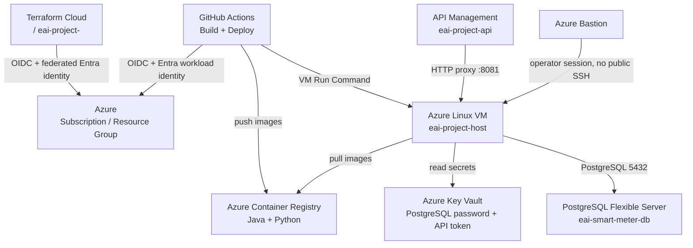
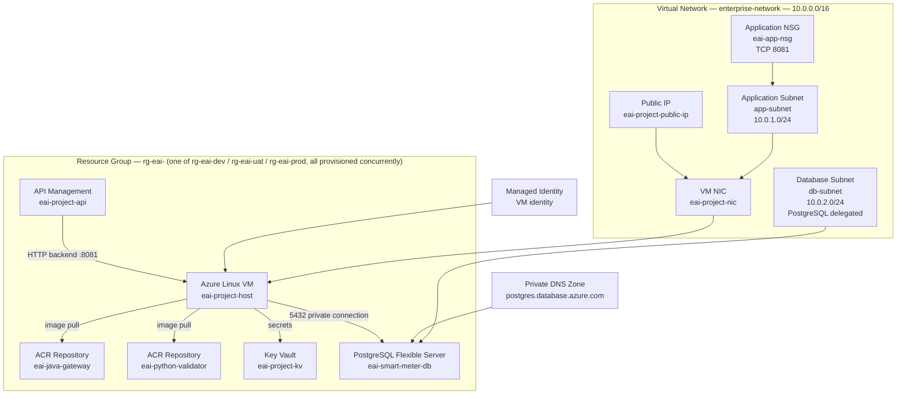
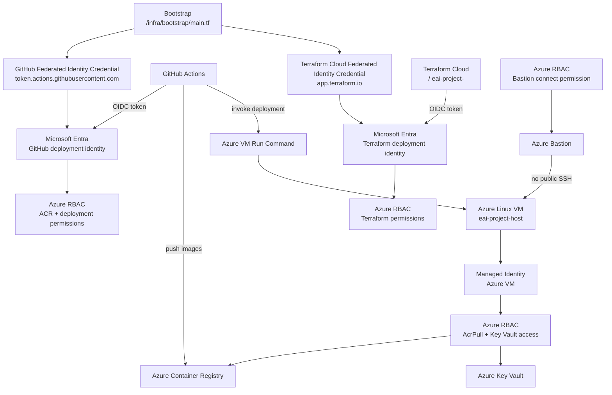

# INFRA_VIEW — Understand the Infrastructure

This view is intentionally split into four layers. Read them in order: **Big Picture → Azure → Identity / Deployment → Terraform Map**.

The detailed resource names, Terraform resource types, source files, usage relationships, and purposes are retained below, but are separated so that the infrastructure can be understood progressively.

---

# 1. Big Picture — How everything works



### The story in plain English

1. **Terraform Cloud** runs the infrastructure Terraform and authenticates to Azure using workload identity federation.
2. **GitHub Actions** builds the application images, pushes them to Azure Container Registry, and invokes Azure VM Run Command to deploy them to the VM.
3. **API Management** is the public HTTP entry point and proxies requests to the application VM on port `8081`.
4. **Azure Linux VM** hosts the Java and Python application containers. Its managed identity provides Azure resource access without stored Azure credentials. No inbound SSH rule exists on the VM; an operator reaches it interactively only through Azure Bastion.
5. **Azure Database for PostgreSQL Flexible Server** provides the PostgreSQL database and is accessed privately by the application VM.
6. **Azure Key Vault** stores application secrets such as the database password and API security token.
7. DEV, UAT, and PROD are separately and persistently provisioned; each has its own resource group (`rg-eai-dev`, `rg-eai-uat`, `rg-eai-prod`) shown as one representative instance below. Promotion between environments redeploys the same image digest into the next environment's resource group and never destroys another environment's resources.

---

# 2. Azure Infrastructure — What exists



## Important network facts

- Azure has no single resource named "Internet Gateway." Azure provides system routing by default, and explicit public/private connectivity is represented by resources such as Public IPs, route tables, NAT gateways, firewalls and private networking components as required.
- `app-subnet` is the application subnet. The VM NIC is attached to it and the application NSG controls network traffic.
- `db-subnet` is the database subnet. PostgreSQL Flexible Server private access uses a delegated PostgreSQL subnet together with private DNS.
- A route table is associated directly with an Azure subnet when custom routes are required; the association is a property of the subnet's routing configuration, not a separate standing resource.
- Key Vault and VM Run Command have separate responsibilities: Key Vault stores secrets; VM Run Command executes deployment commands on the VM.

## Azure resource inventory

| Azure entity | Terraform resource / logical resource | Azure name / identifier | Defined in | Used by / relationship | Purpose |
|---|---|---|---|---|---|
| Resource Group | `azurerm_resource_group.eai` | `rg-eai-dev` / `rg-eai-uat` / `rg-eai-prod` — all three exist and run concurrently | `resource-group.tf` | All Azure resources | Logical management boundary, one per environment |
| Virtual Network | `azurerm_virtual_network.enterprise_network` | `enterprise-network` | `networking.tf` | Subnets, NSG, routes | Network boundary `10.0.0.0/16` |
| Application Subnet | `azurerm_subnet.app` | `app-subnet` | `networking.tf` | VM NIC | Application network `10.0.1.0/24` |
| Database Subnet | `azurerm_subnet.db` | `db-subnet` | `networking.tf` | PostgreSQL Flexible Server | Private database network `10.0.2.0/24` |
| Route Table | `azurerm_route_table.public_rt` | `public-rt` | `networking.tf` | Application subnet | Custom routing when required |
| NSG | `azurerm_network_security_group.app_nsg` | `eai-app-nsg` | `networking.tf` | Application subnet / NIC | Application network security |
| Public IP | `azurerm_public_ip.vm` | `eai-project-public-ip` | `networking.tf` | VM NIC | Public connectivity where required |
| VM NIC | `azurerm_network_interface.app` | `eai-project-nic` | `compute.tf` | VM | Connects VM to application subnet |
| Azure VM | `azurerm_linux_virtual_machine.sandbox` | `eai-project-host` | `compute.tf` | APIM, ACR, Key Vault, PostgreSQL | Runs application containers |
| Azure Bastion | `azurerm_bastion_host.eai` | `eai-project-bastion` | `networking.tf` | Operator sessions to VM | RBAC-authorized interactive access; no public SSH |
| Managed Identity | VM system-assigned identity | `eai-vm-identity` | `identity.tf` / `compute.tf` | VM | Runtime Azure identity |
| ACR | `azurerm_container_registry.eai` | `eaiprojectacr` (ACR names are alphanumeric only; no hyphens permitted) | `acr.tf` | GitHub Actions and VM | Container image registry |
| ACR repository | ACR repository | `eai-java-gateway` | `acr.tf` | GitHub Actions / VM | Java application image |
| ACR repository | ACR repository | `eai-python-validator` | `acr.tf` | GitHub Actions / VM | Python application image |
| Key Vault | `azurerm_key_vault.eai` | `eai-project-kv` | `key-vault.tf` | VM / deployment configuration | Secret storage |
| Key Vault secret | `azurerm_key_vault_secret.*` | DB password / API token | `key-vault.tf` | Application runtime | Sensitive configuration |
| PostgreSQL Flexible Server | `azurerm_postgresql_flexible_server.smart_meter_db` | `eai-smart-meter-db` | `postgresql.tf` | VM | PostgreSQL database server |
| PostgreSQL database | `azurerm_postgresql_flexible_server_database.*` | `smart_meter_warehouse` | `postgresql.tf` | Application | Application database |
| Private DNS Zone | `azurerm_private_dns_zone.postgres` | `postgres.database.azure.com` | `postgresql.tf` | PostgreSQL private endpoint resolution | Private name resolution |
| API Management | `azurerm_api_management.eai` | `eai-project-api` | `api-management.tf` | Clients → VM | Public API boundary |
| APIM API | `azurerm_api_management_api.eai` | Project API | `api-management.tf` | APIM | API contract and operations |
| APIM backend | `azurerm_api_management_backend.vm` | VM backend | `api-management.tf` | APIM → VM | Backend integration |

---

# 3. Identity / Deployment



## The crucial Azure identity distinction

Azure separates **identity**, **federated trust**, and **RBAC permissions**.

### GitHub Actions

1. GitHub Actions issues an OIDC token.
2. Microsoft Entra validates the federated identity credential for the repository/environment.
3. Azure issues a short-lived access token for the deployment identity.
4. Azure RBAC determines the permitted actions.
5. GitHub Actions can push application images to ACR and invoke the deployment mechanism according to its assigned permissions.

### Terraform Cloud

Terraform Cloud authenticates through workload identity federation. The federated identity credential establishes the trust relationship, while Azure RBAC grants the Terraform identity permission to create and manage the infrastructure.

### VM runtime identity

The Azure VM uses a managed identity rather than stored Azure credentials. RBAC assignments grant the VM only the permissions required at runtime, such as pulling images from ACR and reading required Key Vault secrets.

---

# 4. Terraform Map — Where is everything defined?

The Azure infrastructure is organized into a bootstrap root module and a main resource configuration, kept separate for the reason explained in `ARCHITECTURE_AZURE.md`, Appendix A.6:

```text
/infra
│
├── bootstrap/
│   └── main.tf
│       ├── GitHub federated identity trust
│       ├── Terraform Cloud federated identity trust
│       ├── Entra deployment identities
│       └── bootstrap Azure RBAC assignments
│
├── main.tf
│   ├── Terraform / HCP Terraform configuration
│   ├── azurerm provider
│   └── subscription / tenant configuration
│
├── resource-group.tf
│   └── azurerm_resource_group.eai
│
├── networking.tf
│   ├── azurerm_virtual_network.enterprise_network
│   ├── azurerm_subnet.app
│   ├── azurerm_subnet.db
│   ├── azurerm_network_security_group.app_nsg
│   ├── azurerm_route_table.public_rt
│   └── azurerm_public_ip.vm
│
├── compute.tf
│   ├── azurerm_network_interface.app
│   └── azurerm_linux_virtual_machine.sandbox
│
├── identity.tf
│   ├── Entra / managed identity definitions
│   ├── azurerm_federated_identity_credential.*
│   └── azurerm_role_assignment.*
│
├── acr.tf
│   ├── azurerm_container_registry.eai
│   └── ACR repository / cleanup configuration
│
├── key-vault.tf
│   ├── azurerm_key_vault.eai
│   └── azurerm_key_vault_secret.*
│
├── postgresql.tf
│   ├── azurerm_postgresql_flexible_server.smart_meter_db
│   ├── azurerm_postgresql_flexible_server_database.*
│   ├── azurerm_private_dns_zone.postgres
│   └── subnet delegation / private networking
│
└── api-management.tf
    ├── azurerm_api_management.eai
    ├── azurerm_api_management_api.eai
    ├── azurerm_api_management_backend.vm
    └── API operation / route configuration
```

---

# 5. End-to-end flows

## 5.1 Infrastructure provisioning

```text
HCP Terraform
     │
     │ OIDC workload identity token
     ▼
Microsoft Entra ID
     │
     │ Federated identity validation
     ▼
Terraform deployment identity
     │
     │ Azure RBAC
     ▼
Azure Resource Group
     │
     ├── VNet / Subnets / NSG / Routes
     ├── VM + Managed Identity
     ├── ACR
     ├── Key Vault
     ├── PostgreSQL Flexible Server
     └── API Management
```

## 5.2 Application deployment

```text
GitHub Actions
     │
     │ GitHub OIDC token
     ▼
Microsoft Entra ID
     │
     │ Federated identity validation
     ▼
GitHub deployment identity
     │
     ├──────────────► ACR
     │                 │
     │                 │ Java + Python images
     │                 ▼
     │              Azure Container Registry
     │
     └──────────────► VM Run Command
                         │
                         ▼
                     Azure Linux VM
                         │
                         ├── pull images from ACR
                         ├── update containers
                         └── restart application
```

## 5.3 Runtime request/data flow

```text
Client
  │
  ▼
Azure API Management
  │
  │ HTTP :8081
  ▼
Azure Linux VM
  │
  ├── Java Gateway container
  │       │
  │       ▼
  │   Python Validator container
  │
  ├── Key Vault ───────► secrets
  │
  └── PostgreSQL Flexible Server :5432
```

---

# 6. Things that are easy to misunderstand

1. **Bootstrap is separate from normal infrastructure.** `/infra/bootstrap/main.tf` establishes the federated identities and initial permissions required by the normal infrastructure layer.
2. **Azure identity is not a single IAM-role resource.** Identity, federation and RBAC assignments are separate concerns.
3. **Terraform Cloud does not equal Azure.** Terraform Cloud is the execution/control plane; Azure contains the provisioned infrastructure.
4. **API Management does not run the application.** It proxies requests to the VM backend.
5. **The VM does not require long-lived Azure credentials.** Its managed identity provides runtime authentication.
6. **Key Vault does not execute deployment commands.** Secrets are stored in Key Vault; VM Run Command performs remote execution.
7. **PostgreSQL private networking uses a delegated subnet, not a subnet group.** Azure Database for PostgreSQL Flexible Server reaches private connectivity through a delegated PostgreSQL subnet and a private DNS zone.
8. **ACR contains separate application repositories.** Java and Python images are independently versioned artifacts.
9. **Data sources and policy definitions are Terraform-side constructs.** They should not automatically be interpreted as deployed Azure resources.
10. **RBAC scope matters.** A role assignment at subscription, resource-group, registry, vault or resource scope grants materially different authority.
11. **The resource group shown in this document represents one of three coexisting environments.** `rg-eai-dev`, `rg-eai-uat`, and `rg-eai-prod` all exist and run concurrently in this reference implementation; none is destroyed to make room for another. This is a release-management choice documented in `ARCHITECTURE_AZURE.md`, not a structural requirement — a third party may choose a leaner strategy where environments are not all persistently provisioned.
12. **VM Run Command and Azure Bastion serve different purposes.** VM Run Command is the automated deployment path invoked by GitHub Actions; Azure Bastion is the human operator's interactive troubleshooting path. Neither substitutes for the other, and neither requires a network-exposed SSH port.
